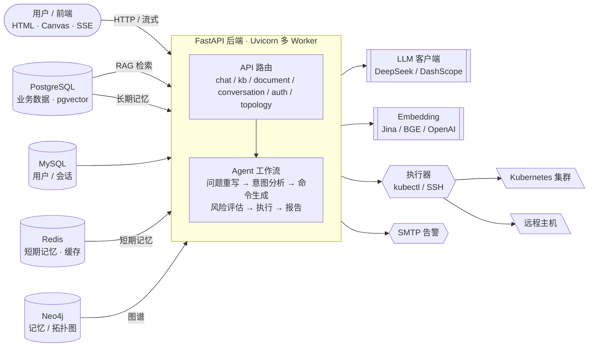

# Aitem · Kubedoctor

AI 驱动的 Kubernetes 集群智能运维助手。以对话的方式理解你的需求，结合**实时集群信息**、**知识库检索（RAG）** 与**长期记忆**，自动生成并执行 `kubectl` / 远程命令，最终反馈执行结果与报告。

## 功能特性

- 💬 **对话式运维**：多轮对话，流式回复、报告下载
- 🧠 **多级记忆**：短期记忆（Redis）+ 长期记忆（PostgreSQL + Neo4j 图），定时衰减与合并
- 📚 **知识库 RAG**：文档上传、向量化、语义检索、上下文增强；多模态图片解析
- 🔍 **智能工作流**：问题重写 → 意图分析 → 命令生成 → 风险评估 → 逐步执行 → 结果观察
- 🎛 **多 Agent 协作**：CommandRewriter / Orchestrator / 工具调用白名单 / 失败重试
- 🕸 **集群拓扑可视化**：实时读取 K8s 集群，生成可交互拓扑图（命名空间 / 工作负载 / Pod / 服务）
- 📬 **告警通知**：SMTP 邮件告警
- ⚡ **高并发**：FastAPI 异步 + 多 worker 部署，连接池调优

## 系统架构




## 界面展示

> 把界面截图或运行录屏放到根目录 `assets/` 文件夹，替换下面占位即可直接展示。

### 📷 界面截图

| 截图 | 说明 |
| --- | --- |
|  | 对话主界面 |
|  | 集群拓扑可视化 |

## 技术栈

| 层面 | 技术 |
| --- | --- |
| 后端 | Python 3.13 · FastAPI · Uvicorn（多 worker） |
| 前端 | 原生 HTML / CSS / JS（Canvas 拓扑图） |
| 数据库 | PostgreSQL (pgvector) · MySQL · Redis |
| 图数据库 | Neo4j |
| 大模型 | DeepSeek（OpenAI 兼容）、阿里云 DashScope 多模态 |
| 向量 | Jina / BGE / OpenAI Embedding |
| 执行 | kubectl · paramiko(SSH) |
| 部署 | Docker Compose · Conda |

## 目录结构

```
aitem/
├── main.py              # 应用入口 · 后台任务 · 路由注册
├── start.ps1            # 一键启动脚本
├── docker-compose.yml   # Redis / PostgreSQL / Neo4j / MySQL
├── .env.example         # 环境配置示例
├── app/
│   ├── api/             # HTTP 接口（chat / auth / kb / document / graph...）
│   ├── core/            # 配置与公共组件
│   ├── db/              # PostgreSQL / Neo4j / MySQL 连接与仓储
│   ├── llm/             # 模型客户端 / embedding / agents
│   ├── memory/          # 记忆策略 / 图 / 模型 / 衰减任务
│   ├── knowledge/       # 知识库入库 / 检索 / RAG
│   ├── document/        # 文档解析与多模态抽取
│   ├── prompt/          # 提示词模板
│   ├── schemas/         # 数据模型
│   ├── tools/           # 外部工具（SSH / 邮件等）
│   └── services/        # 业务服务
├── web/static/          # 前端（index.html / app.js / style.css）
└── scripts/             # 运维与迁移脚本
```

## 快速开始

### 1. 安装依赖并启动中间件

```bash
# 创建并激活 Conda 环境（环境名建议 aitem，Python 3.13）
conda create -n aitem python=3.13 -y
conda activate aitem
pip install -r requirements.txt

# 启动 Docker 中间件（Redis / PostgreSQL / Neo4j / MySQL）
docker compose up -d
```

### 2. 配置环境变量

复制 `.env.example` 为 `.env`，填入数据库、模型、向量、可视化等密钥与地址：

```bash
cp .env.example .env
```

> 必须配置项：`POSTGRES_*`、`DEEPSEEK_API_KEY`、`EMBEDDING_*`（Jina 或 BGE）、`NEO4J_*`、`MYSQL_*`。

### 3. 启动服务

一键脚本（自动拉起 Docker、启动后端并打开前端）：

```powershell
.\start.ps1
```

或手动启动：

```bash
uvicorn main:app --workers 4 --host 0.0.0.0 --port 8000
```

打开浏览器访问 `http://localhost:8000/`。

## 配置说明

| 变量 | 说明 | 默认 |
| --- | --- | --- |
| `WEB_WORKERS` | Uvicorn 工作进程数 | `4` |
| `POSTGRES_POOL_MAX` | PostgreSQL 连接池上限 | `20` |
| `POSTGRES_POOL_MIN` | PostgreSQL 连接池下限 | `2` |
| `DEEPSEEK_API_KEY` | 大模型 API Key | - |
| `DEEPSEEK_MODEL` / `DEEPSEEK_FALLBACK_MODEL` | 主 / 备用模型 | deepseek-chat / deepseek-reasoner |
| `EMBEDDING_PROVIDER` | 向量提供方：jina / bge / openai | jina |
| `NEO4J_WRITE_ENABLED` | 聊天记忆/工具审计图是否写入 Neo4j | true |
| `RAG_TOP_K` / `RAG_RERANK_TOP_K` | 知识检索数量 | 10 / 3 |
| `KEEP_RAW_FILE` | 上传入库后是否保留原文件 | false |
| `TEST_MODE` | 测试模式（默认不自动执行命令） | false |

## 主要 API

| 方法 | 路径 | 说明 |
| --- | --- | --- |
| POST | `/chat` | 对话（实时） |
| POST | `/chat/stream` | 对话（SSE 流式） |
| POST | `/chat_with_document` | 基于文档对话 |
| GET | `/chat/report/{conv_id}` | 下载报告 |
| POST | `/upload` | 上传文档 |
| GET/POST | `/conversations` | 会话管理 |
| GET/POST | `/kb`、`/kb/list`、`/kb/{id}` | 知识库管理 |
| POST | `/kb/{id}/upload`、`/search`、`/batch-upload` | 知识库文档处理与检索 |
| GET | `/topology`、`/rebuild` | 集群拓扑读取 / 重建 |
| POST | `/register`、`/login` | 用户认证 |

## 部署与并发

- **多进程**：`WEB_WORKERS` 控制 worker 数，建议与 CPU 核数匹配；多 worker 下后台任务（记忆衰减、拓扑重建）通过 Redis 锁保证只在一个 worker 执行。
- **连接池**：`POSTGRES_POOL_MAX` 按 worker 生效，需随 worker 数上调；更高并发建议接入连接池网关（如 PgBouncer）。
- **真正并发上限**：单机查询类接口可达数千 QPS；AI 对话类受远程大模型调用延迟限制，追求更大并发需横向扩展实例 + 负载均衡。

## 说明

- 本项目面向 Kubernetes 集群运维场景；实际执行命令前请确认 `TEST_MODE` 与集群权限。
- 远程命令、SSH 主机凭据等敏感信息请妥善保管。


