# aitem（Kubedoctor）项目技术报告（工业化完整版）

> 版本：v3.0 ｜ 生成日期：2026-08-11 ｜ 事实来源：`D:\desktop\aitem`（master @ 3e3a165）
> 摘要：AI 驱动的 Kubernetes 集群智能运维助手。本文档覆盖项目全景、数据库全集、兜底策略全集、核心业务数据流转、测试质量、运维应急、ADR、技术债务、合规安全，并附完整附录。

---

## 目录

- [第0章 报告说明](#0-报告说明)
- [第1章 项目全景](#1-项目全景)
- [第2章 数据库设计全集](#2-数据库设计全集)
- [第3章 兜底策略全集](#3-兜底策略全集)
- [第4章 核心业务数据流转](#4-核心业务数据流转)
- [第5章 测试与质量保障](#5-测试与质量保障)
- [第6章 运维与应急](#6-运维与应急)
- [第7章 技术决策记录ADR](#7-技术决策记录adr)
- [第8章 技术债务与演进路线](#8-技术债务与演进路线)
- [第9章 合规与安全](#9-合规与安全)
- [附录A DDL集合](#附录a-ddl集合)
- [附录B 配置清单](#附录b-配置清单)
- [附录C 策略速查卡](#附录c-策略速查卡)
- [附录D 枚举常量状态码](#附录d-枚举常量状态码)
- [附录E 数据字典](#附录e-数据字典)
- [附录F 核心类索引](#附录f-核心类索引)
- [附录G API端点清单](#附录g-api端点清单)
- [附录H Mermaid源码](#附录h-mermaid源码)
- [附录I 项目文件树](#附录i-项目文件树)
- [附录J 依赖清单](#附录j-依赖清单)
- [索引](#索引)

---

# 0 报告说明

## 0.1 报告目的与使用场景

本报告以桌面 `D:\desktop\aitem`（Kubedoctor）项目的实际代码、配置、数据定义与文档为唯一事实来源，目标是：可审计（每条结论标注来源）、可运维（第3/6章定位兜底策略）、可传承（决策可追溯）、可演进（作基线对照）。

## 0.2 分析范围与局限性声明

**范围**：覆盖 `main.py`、`app/` 全部源码、`.env`/`.env.example`/`docker-compose.yml`/`pytest.ini`/`requirements.txt` 等配置；覆盖 PostgreSQL/MySQL/Redis/Neo4j 四类数据源。

**局限性**（客观声明）：
- 本报告基于**静态代码分析**，未动态运行，未做压测/故障注入，故运行态数据（触发次数、成功率、SLA、压测指标）均为【推断】或【未实现】。
- `data/` 为数据库二进制数据，未解析内部；表数据量级/存储大小需运行时核实。
- 项目本身为 **Python/FastAPI** 技术栈，原始模板中的 Java/Spring 概念已映射到 Python 实现；无对应实现处标注【未实现】。
- 敏感凭据仅列配置键名，不披露实际值（附录B脱敏）。

## 0.3 代码版本信息

| 项 | 值 |
|---|---|
| 当前分支 | `master` |
| 最新 Commit | `3e3a1652660bd663adf4845507333bb0b5eb91e4` |
| 提交时间 | 2026-08-07 16:30:49 +0800（wxm） |
| 提交说明 | `feat: 补齐近期开发改动` |
| Remote | origin=`github.com/pangddm/aitem`；paper=`wxmadm/aibf.git` |
| 工作区 | 有未提交修改（约25个文件）【来源: git log/git status】 |

## 0.4 报告版本与更新记录

| 版本 | 日期 | 说明 | 作者 |
|---|---|---|---|
| v3.0 | 2026-08-11 | 基于 master@3e3a165 生成 | Codex |

## 0.5 术语表

| 术语 | 定义 |
|---|---|
| RAG | 检索增强生成 |
| RRF | 倒数排名融合 |
| HNSW | 层级可导航小世界向量索引 |
| pgvector | PostgreSQL 向量扩展 |
| SSE | 服务端流式推送 |
| LLM | 大语言模型 |
| Agent | 自主执行工作流的智能体 |
| ADR | 架构决策记录 |
| RPO/RTO | 恢复点/恢复时间目标 |
| SLA | 服务等级协议 |
| DDL | 数据定义语言 |
| ER | 实体关系 |

## 0.6 角色阅读指南

| 角色 | 建议章节 |
|---|---|
| 研发/架构师 | 1、2、3、4、7、8章 + 附录A–J |
| 运维/DevOps | 3、6、2章 + 附录B/C |
| 测试 | 5、4章 + 附录D/E/G |
| 产品/管理 | 1章、精简版、8章 |
| 审计/合规 | 9章、附录D |

---

# 1 项目全景

## 1.1 项目简介与核心功能

**定位**：Kubedoctor 是以对话方式结合实时集群信息 + 知识库 RAG + 长期记忆，自动生成并执行 `kubectl`/远程命令并反馈报告的 AI Kubernetes 智能运维助手。

核心功能：对话式运维（SSE 流式 + 报告下载）、多级记忆（Redis 短记忆 + PG/Neo4j 长记忆、定时衰减合并）、知识库 RAG（文档上传/向量化/语义检索/上下文增强）、智能工作流（重写→意图→命令→风险评估→执行→观察）、多 Agent 协作、集群拓扑可视化、SMTP 告警。【来源: README.md】

## 1.2 技术栈

| 层级 | 技术 | 版本 | 选型理由 | 备选方案 | 决策人 | 决策日期 |
|---|---|---|---|---|---|---|
| 语言 | Python | 3.13 | AI 生态、异步 | Go/Node | wxm | 推断 |
| Web | FastAPI | 0.115.6 | 原生 async、OpenAPI | Flask/Django | wxm | 推断 |
| ASGI | uvicorn | 0.34.0 | FastAPI 标准、多 worker | gunicorn | wxm | 推断 |
| 主库 | PostgreSQL17+pgvector | docker pgvector/pg17 | 向量+JSONB | MySQL/ES | wxm | 推断 |
| 认证库 | MySQL 8.0 | docker mysql:8.0 | 兼容旧 users 表 | 迁 PG | wxm | 推断 |
| 缓存 | Redis 7 | docker redis:7 | 短记忆/锁 | Memcached | wxm | 推断 |
| 图库 | Neo4j | latest | 拓扑/记忆图 | JanusGraph | wxm | 推断 |
| 向量 | sentence-transformers/Jina/DashScope | 3.3.1 | 多 provider 主备 | OpenAI emb | wxm | 推断 |
| LLM | DeepSeek(OpenAI兼容) | openai 1.59.7 | 低成本兼容 | 通义 | wxm | 推断 |
| 文档 | PyMuPDF/python-docx | 1.28.0/1.1.2 | 表格/OCR | pdfplumber | wxm | 推断 |
| SSH | paramiko | 3.5.0 | 远程执行 | asyncssh | wxm | 推断 |
| 前端 | HTML/Canvas/JS | — | 轻量拓扑 | React/Vue | wxm | 推断 |

【来源: requirements.txt、docker-compose.yml】

## 1.3 模块结构

```text
aitem/
├─ main.py                      # 应用装配/lifespan/health
├─ app/
│  ├─ api/                      # FastAPI 路由
│  ├─ core/                     # config/logger/retry
│  ├─ db/                       # postgres/redis/neo4j/mysql/schema/repository
│  ├─ document/                 # 文档解析
│  ├─ knowledge/                # RAG 知识库
│  ├─ llm/                      # LLM 客户端/agents/embedding
│  ├─ memory/                   # 多级记忆
│  ├─ prompt/                   # 提示词模板
│  ├─ schemas/                  # Pydantic 校验
│  ├─ services/                 # 业务服务
│  └─ tools/                    # ssh/k8s/mail
├─ web/static/                  # 前端
├─ tests/                       # pytest
├─ scripts/                     # 运维脚本
├─ docs/                        # 设计文档
├─ data/                        # DB 二进制数据
├─ docker-compose.yml / .env / requirements.txt
```

各模块职责与核心类：
- `app/core`：`config.py`（配置）、`retry.py`（`retry_async/retry_sync/is_db_retryable`）、`logger.py`（JsonFormatter）。
- `app/db`：`schema.py`（PG 全部建表）、`postgres.py`（asyncpg 池）、`redis.py`（单例）、`neo4j.py`（async driver）、`repository/*`。
- `app/knowledge`：`ingestion/extractor/retriever/reranker/cache/factory/repository`。
- `app/llm/agents`：`workflow.py` 状态机 + `command_rewriter/orchestrator/validator/observer/reporter/executor/risk_assessor`。
- `app/memory`：`short_term/long_term/extractor/merge/updater/graph/indexer/repository/job/decay`。
- `app/tools`：`ssh_client`（带池）、`k8s_tools`、`send_mail`、`tool_registry`。

## 1.4 配置文件生态

| 文件 | 作用 | 环境差异 | 加载顺序 |
|---|---|---|---|
| `.env` | 环境变量/凭据 | 各环境独立 | 各模块 `load_dotenv()` |
| `.env.example` | 配置模板(脱敏) | 参考 | — |
| `app/core/config.py` | 配置常量(带默认值) | 读环境变量 | 导入时 |
| `docker-compose.yml` | 基础设施编排 | 开发/自托管 | 构建时 |
| `pytest.ini` | pytest 配置 | 测试 | pytest |
| `requirements.txt` | 依赖锁定 | 各环境 | pip |

【来源: 各文件本身】

## 1.5 外部依赖清单

见附录J。核心依赖：fastapi、uvicorn、asyncpg、pgvector、sqlalchemy、pymysql、redis、neo4j、openai、httpx、paramiko、PyMuPDF、python-docx、sentence-transformers、pydantic、pydantic-settings、python-dotenv、cryptography、numpy、python-multipart。【来源: requirements.txt】

## 1.6 系统架构图

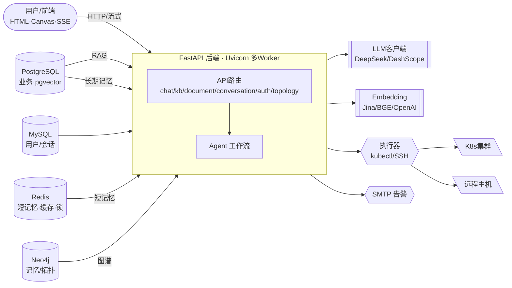
```mermaid
flowchart LR
    U([用户/前端<br/>HTML·Canvas·SSE]) -->|HTTP/流式| API
    subgraph API[FastAPI 后端 · Uvicorn 多Worker]
        RT[API路由<br/>chat/kb/document/conversation/auth/topology]
        WF[Agent 工作流]
        RT --> WF
    end
    API --> LLM[[LLM客户端<br/>DeepSeek/DashScope]]
    API --> EMB[[Embedding<br/>Jina/BGE/OpenAI]]
    API --> EXEC{{执行器<br/>kubectl/SSH}}
    API --> MAIL{{SMTP 告警}}
    EXEC --> K8S[\K8s集群\]
    EXEC --> HOST[\远程主机\]
    PG[(PostgreSQL<br/>业务·pgvector)]
    MY[(MySQL<br/>用户/会话)]
    RD[(Redis<br/>短记忆·缓存·锁)]
    NE[(Neo4j<br/>记忆/拓扑)]
    PG -->|RAG| API
    PG -->|长期记忆| API
    MY --> API
    RD -->|短记忆| API
    NE -->|图谱| API
```
【来源: README.md（同构）】

## 1.7 部署拓扑

- 基础设施：`docker-compose.yml` 定义 redis/pgvector/neo4j/mysql 四容器，卷挂 `./data/*`。
- 后端：`main.py` + uvicorn 多 worker（`WEB_WORKERS=4`）。
- 前端：`web/static` 由 FastAPI 挂载（main.py:70）。
- 目标集群经 SSH 连接 `TARGET_HOST` 执行 `kubectl`；不在集群内部署。
- 生产实例数与资源配置【未实现: 无 k8s 部署清单】。

【来源: docker-compose.yml、.env.example、main.py】
---

# 2 数据库设计全集

## 2.0 数据源总览

| 数据源 | 版本 | 角色 | 连接库/库名 | 访问方式 | 定义位置 |
|---|---|---|---|---|---|
| PostgreSQL | 17(pgvector) | 持久化主库 | kubedoctor | asyncpg 连接池 | `app/db/postgres.py`、`app/db/schema.py` |
| MySQL | 8.0 | 用户认证兼容 | Users | SQLAlchemy+PyMySQL | `app/db/mysql/` |
| Redis | 7 | 缓存/短记忆/锁 | db0(默认) | redis 同步客户端 | `app/db/redis.py` |
| Neo4j | latest | 图/拓扑/审计关系 | 默认 | neo4j async driver | `app/db/neo4j.py`、`app/memory/graph/schema.py` |

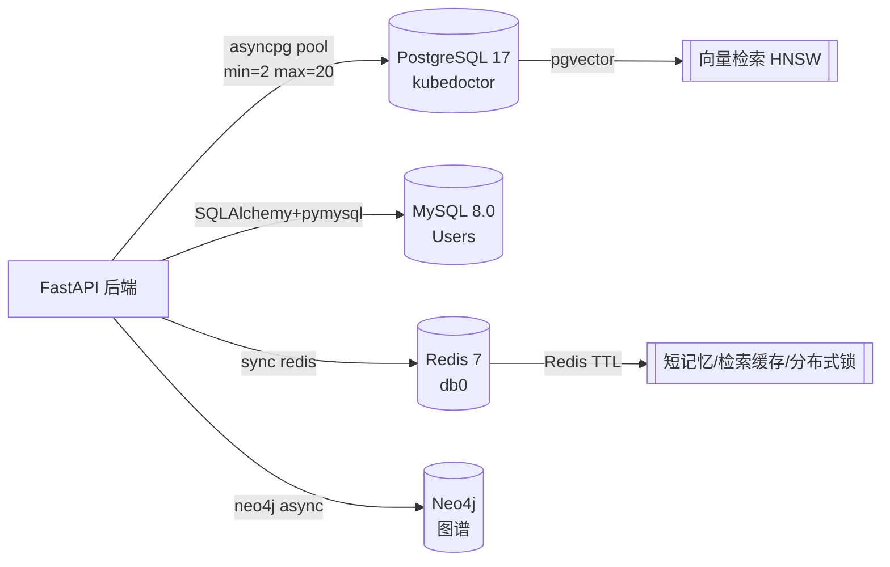
```mermaid
flowchart LR
    API[FastAPI 后端]
    API -->|asyncpg pool<br/>min=2 max=20| PG[(PostgreSQL 17<br/>kubedoctor)]
    API -->|SQLAlchemy+pymysql| MY[(MySQL 8.0<br/>Users)]
    API -->|sync redis| RD[(Redis 7<br/>db0)]
    API -->|neo4j async| NE[(Neo4j<br/>图谱)]
    PG -->|pgvector| VEC[[向量检索 HNSW]]
    RD -->|Redis TTL| MEM[[短记忆/检索缓存/分布式锁]]
```
【来源: app/db/*.py、docker-compose.yml】

连接池参数：PG `POSTGRES_POOL_MIN=2`、`POSTGRES_POOL_MAX=20`（.env.example）；MySQL `pool_pre_ping=True`（mysql/database.py）。

## 2.1 数据库设计原则与规范

- 主键统一 UUID；`owner` 字段统一存用户 UUID（schema.py 头注释）。
- PostgreSQL 为持久化主库，Redis 仅缓存，Neo4j 仅存图关系，MySQL 仅存认证【来源: schema.py:4-8】。
- 软删除：`document`/`incident` 用 `deleted_at` 而非物理删除。
- `updated_at` 由触发器自动更新（`update_updated_at()`，schema.py:350-372）。
- 全文内容 `origin_text/ocr_text` 存 PG 而非前端文件（schema.py:173-174）。
- 幂等建表：全部 `CREATE TABLE IF NOT EXISTS` + `ADD COLUMN IF NOT EXISTS` 迁移（schema.py）。

## 2.2 表结构详述

### 2.2.1 表 app_user（用户表）

**1) 表基本元信息**

| 项 | 值 |
|---|---|
| 表名 | `app_user` |
| 所属库 | PostgreSQL kubedoctor |
| 业务域 | 认证/用户 |
| 引擎 | PostgreSQL（无引擎概念） |
| 字符集 | UTF-8 |
| 行格式 | 堆表（Heap） |
| 创建时间 | 由 init_db 首次创建【推断】 |
| 最后变更时间 | 见报告日期（未跟踪）【推断】 |
| 数据量级 | 【推断: 需运行时核实】 |
| 存储大小 | 【推断: 需运行时核实】 |

**2) 字段定义表**

| 字段 | 类型 | 长度/精度 | 可空 | 默认 | 自增 | 主键 | 唯一键 | 索引 | 外键 | 业务含义 | 值域约束 | 数据敏感等级 |
|---|---|---|---|---|---|---|---|---|---|---|---|---|
| id | UUID | — | 否 | — | 否 | ✔ | — | PK | — | 用户ID | — | 高 |
| username | TEXT | — | 否 | — | 否 | — | ✔ | 唯一索引 | — | 用户名 | — | 中 |
| password_hash | TEXT | — | 否 | — | 否 | — | — | — | — | 密码哈希 | — | 高 |
| salt | TEXT | — | 否 | '' | 否 | — | — | — | — | 加盐 | — | 高 |
| email | TEXT | — | 是 | NULL | 否 | — | — | — | — | 邮箱【推断用】 | — | 中 |
| avatar | TEXT | — | 是 | NULL | 否 | — | — | — | — | 头像 | — | 低 |
| is_active | BOOLEAN | — | 是 | TRUE | 否 | — | — | — | — | 启用状态 | true/false | 低 |
| created_at | TIMESTAMP | — | 否 | — | 否 | — | — | — | — | 创建时间 | — | 低 |
| updated_at | TIMESTAMP | — | 否 | — | 否 | — | — | — | — | 更新时间 | — | 低 |

**3) 索引定义表**

| 索引名 | 类型 | 字段组合 | 用途 | 对应SQL | 命中次数预估 |
|---|---|---|---|---|---|
| 无显式业务索引（仅 PK） | BTree(PK) | id | 主键查找 | `WHERE id=?` | 【推断】 |

**4) 约束定义表**

| 约束名 | 类型 | 字段 | 规则 | 业务意义 |
|---|---|---|---|---|
| app_user_pkey | 主键 | id | UUID 唯一 | 用户唯一标识 |
| app_user_username_key | 唯一 | username | 唯一，非空 | 用户名不重复 |
| memory/app_user CHECK | — | — | — | — |

**5) 关联关系**：被 `host`、`conversation`、`memory`、`knowledge_base`、`document`、`incident` 以 `owner` 外键引用（ON DELETE CASCADE）。

**6) 字段级数据字典**：`is_active` ∈ {true,false}（默认 true）；`password_hash/salt` 为哈希+盐存储【来源: app/db/mysql 亦见 hash_passwords.py】。

**7) 表生命周期策略**【未实现: 无归档/清理任务针对本表】。

**8) 表访问权限**【推断: 仅后端服务访问；无独立 DB 角色定义】。

**9) 相关业务场景**：见场景S2（登录/认证）。

**10) 相关兜底策略**：见策略P6（数据库重试）、P0全局重试。

【来源: app/db/schema.py:30-42】

---

### 2.2.2 表 host（主机表）

**1) 元信息**：PostgreSQL kubedoctor；业务域=SSH主机；密码加密存储；数据量级【推断】。

**2) 字段定义表**

| 字段 | 类型 | 可空 | 默认 | 主键 | 外键 | 业务含义 | 敏感 |
|---|---|---|---|---|---|---|---|
| id | UUID | 否 | — | ✔ | — | 主机ID | 高 |
| owner | UUID | 否 | — | — | app_user.id(CASCADE) | 属主 | 中 |
| name | TEXT | 否 | — | — | — | 主机别名 | 低 |
| host | TEXT | 否 | — | — | — | IP/域名 | 中 |
| port | INTEGER | 否 | 22 | — | — | 端口 | 低 |
| username | TEXT | 否 | — | — | — | 登录用户 | 中 |
| password_encrypted | TEXT | 否 | '' | — | — | 加密口令 | 高 |
| created_at/updated_at | TIMESTAMP | 否 | — | — | — | 时间戳 | 低 |

**3) 索引**：`idx_host_owner(owner)` BTree【来源 schema.py:61-64】。
**4) 约束**：PK id；`owner` FK ON DELETE CASCADE。
**5) 关联**：`conversation.host_id` → `host.id`（ON DELETE SET NULL）。
**6) 字典**：port 默认22；password 以 `HOST_ENCRYPTION_KEY` 加密（.env.example: HOST_ENCRYPTION_KEY=留空则不加密）。
**7) 生命周期**【未实现: 无主机清理】。
**8) 权限**【推断: 按 owner 隔离】。
**9) 场景**：S3（主机管理/SSH 会话）。
**10) 兜底**：P9（SSH 超时/连接池）。

【来源: app/db/schema.py:48-64】

---

### 2.2.3 表 conversation（对话表）

**1) 元信息**：PostgreSQL kubedoctor；业务域=对话会话；数据量级【推断】。

**2) 字段定义表**

| 字段 | 类型 | 可空 | 默认 | 主键 | 外键 | 业务含义 |
|---|---|---|---|---|---|---|
| id | UUID | 否 | — | ✔ | — | 会话ID |
| owner | UUID | 否 | — | — | app_user.id(CASCADE) | 属主 |
| title | TEXT | 否 | '新对话' | — | — | 会话标题 |
| host_id | UUID | 是 | NULL | — | host.id(SET NULL) | 关联主机 |
| created_at/updated_at | TIMESTAMP | 否 | — | — | — | 时间戳 |

**3) 索引**：`idx_conversation_owner(owner, updated_at DESC)`。
**4) 约束**：PK；owner FK CASCADE；host_id FK SET NULL。
**5) 关联**：1:N `conversation_message`；N:1 `host`。
**6) 字典**：host_id 可为空（无主机会话）。
**7) 生命周期**【未实现: 无会话归档】。
**8) 权限**【推断: owner 隔离】。
**9) 场景**：S1（对话）、S4（会话管理）。
**10) 兜底**：P6、会话缓存 P8。

【来源: app/db/schema.py:69-82、314-318】

---

### 2.2.4 表 conversation_message（对话消息表）

**1) 元信息**：PostgreSQL kubedoctor；业务域=对话消息；数据量级【推断】。

**2) 字段定义表**

| 字段 | 类型 | 可空 | 默认 | 主键 | 外键 | 业务含义 |
|---|---|---|---|---|---|---|
| id | UUID | 否 | — | ✔ | — | 消息ID |
| conversation_id | UUID | 否 | — | — | conversation.id(CASCADE) | 所属会话 |
| role | TEXT | 否 | — | — | — | 角色 |
| content | TEXT | 否 | — | — | — | 消息内容 |
| thinking_chain | JSONB | 是 | '[]' | — | — | 思考链 |
| created_at | TIMESTAMP | 否 | — | — | — | 创建时间 |

**3) 索引**：`idx_msg_conversation(conversation_id, created_at)`。
**4) 约束**：PK；FK CASCADE；`role` CHECK ∈ (`user`,`assistant`,`system`)。
**5) 关联**：N:1 conversation。
**6) 字典**：role 三态。
**7) 生命周期**【未实现】。
**8) 权限**【推断: owner 隔离】。
**9) 场景**：S1（对话流）。
**10) 兜底**：P6。

【来源: app/db/schema.py:87-100】

---

### 2.2.5 表 memory（长期记忆表，带向量）

**1) 元信息**：PostgreSQL kubedoctor；业务域=长期记忆；含 `embedding VECTOR(1024)`；数据量级【推断】。

**2) 字段定义表**

| 字段 | 类型 | 可空 | 默认 | 主键 | 外键 | 业务含义 |
|---|---|---|---|---|---|---|
| id | UUID | 否 | — | ✔ | — | 记忆ID |
| owner | UUID | 否 | — | — | app_user.id(CASCADE) | 属主 |
| type | TEXT | 否 | — | — | — | 记忆类型 |
| content | TEXT | 否 | — | — | — | 记忆内容 |
| summary | TEXT | 是 | NULL | — | — | 摘要 |
| source | TEXT | 否 | — | — | — | 来源 |
| entities | TEXT[] | 是 | NULL | — | — | 关联实体 |
| importance | REAL | 是 | 0.5 | — | — | 重要性权重 |
| metadata | JSONB | 是 | '{}' | — | — | 元数据 |
| embedding | VECTOR(1024) | 否 | — | — | — | 向量 |
| created_at/updated_at | TIMESTAMP | 否 | — | — | — | 时间戳 |

**3) 索引**：`idx_memory_owner`、`idx_memory_type`、`idx_memory_created(created_at DESC)`、`idx_memory_embedding USING hnsw(vector_cosine_ops)`。【来源 schema.py:121-136】
**4) 约束**：PK；owner FK CASCADE；`source` CHECK ∈ (chat,tool,document,system,k8s,prometheus,manual)（memory_source_check）。
**5) 关联**：N:1 app_user；Neo4j 中经 `HAS_MEMORY/MENTIONS/RELATED_TO` 关联实体。
**6) 字典**：`type` 见附录D（MemoryType：preference/knowledge/experience/document/cluster_state/fault/summary）；`importance REAL 0~1` 衰减依据（job/decay.py）。
**7) 生命周期**：`MemoryDecayJob` 每6小时执行衰减与过期清理（main.py:60-66、app/memory/job/decay.py）。
**8) 权限**【推断: owner 隔离】。
**9) 场景**：S1（对话记忆保存）、S7（记忆衰减）。
**10) 兜底**：P6、P0；衰减任务由 Leader 锁保证单实例（main.py:180）。

【来源: app/db/schema.py:105-136】

---

### 2.2.6 表 knowledge_base（知识库表）

**1) 元信息**：PostgreSQL kubedoctor；业务域=知识库；数据量级【推断】。

**2) 字段定义表**

| 字段 | 类型 | 可空 | 默认 | 主键 | 外键 | 业务含义 |
|---|---|---|---|---|---|---|
| id | UUID | 否 | — | ✔ | — | 知识库ID |
| owner | UUID | 否 | — | — | app_user.id(CASCADE) | 属主 |
| name | TEXT | 否 | — | — | — | 知识库名 |
| description | TEXT | 是 | NULL | — | — | 描述 |
| is_public | BOOLEAN | 是 | FALSE | — | — | 是否公开 |
| created_at/updated_at | TIMESTAMP | 否 | — | — | — | 时间戳 |

**3) 索引**：`idx_kb_owner`、`idx_kb_created(created_at DESC)`。
**4) 约束**：PK；owner FK CASCADE。
**5) 关联**：1:N `document`(kb_id)、1:N `incident`(kb_id)。
**6) 字典**：is_public ∈ {false,true}。
**7) 生命周期**【未实现: 无清理任务】。
**8) 权限**【推断: owner 隔离；is_public 控制共享】。
**9) 场景**：S3（知识库管理）、S5（RAG检索）。
**10) 兜底**：P6；缓存失效 P8。

【来源: app/db/schema.py:141-159】

---

### 2.2.7 表 document（文档表）

**1) 元信息**：PostgreSQL kubedoctor；业务域=文档元数据+全文；软删除；数据量级【推断】。

**2) 字段定义表**

| 字段 | 类型 | 可空 | 默认 | 主键 | 外键 | 业务含义 |
|---|---|---|---|---|---|---|
| id | UUID | 否 | — | ✔ | — | 文档ID |
| owner | UUID | 否 | — | — | app_user.id(CASCADE) | 属主 |
| kb_id | UUID | 否 | — | — | knowledge_base.id(CASCADE) | 所属知识库 |
| filename | TEXT | 否 | — | — | — | 文件名 |
| mime_type | TEXT | 否 | — | — | — | MIME类型 |
| file_size | BIGINT | 否 | — | — | — | 大小(字节) |
| source | TEXT | 否 | — | — | — | 来源 |
| origin_text | TEXT | 是 | NULL | — | — | 原文 |
| ocr_text | TEXT | 是 | NULL | — | — | OCR文本 |
| content_hash | TEXT | 是 | NULL | — | — | 内容哈希(去重) |
| parse_status | TEXT | 否 | 'pending' | — | — | 解析状态 |
| deleted_at | TIMESTAMP | 是 | NULL | — | — | 软删除 |
| metadata | JSONB | 是 | '{}' | — | — | 元数据 |
| created_at/updated_at | TIMESTAMP | 否 | — | — | — | 时间戳 |

**3) 索引**：`idx_document_owner`、`idx_document_kb`、`idx_document_status`、`idx_document_created(created_at DESC)`、`idx_document_owner_hash UNIQUE(owner,content_hash) WHERE content_hash IS NOT NULL`。
**4) 约束**：PK；owner/kb_id FK CASCADE；`document_id` related；`source` CHECK ∈ (upload,manual)；`parse_status` CHECK ∈ (pending,processing,completed,failed)；同用户下 content_hash 唯一（跨知识库去重）。
**5) 关联**：N:1 knowledge_base；1:N incident(document_id)。
**6) 字典**：parse_status 四态（DocumentStatus 枚举，models.py:13）。
**7) 生命周期**：启动惰性清理 `list_stale_noncompleted` 删除24h 未完成残留（main.py:135-155）。
**8) 权限**【推断: owner 隔离】。
**9) 场景**：S3（文档上传/解析）、S5（RAG）。
**10) 兜底**：P7（解析降级）、P2（Embedding降级）。

【来源: app/db/schema.py:164-205、283-291】

---

### 2.2.8 表 incident（知识条目表，RAG 核心）

**1) 元信息**：PostgreSQL kubedoctor；业务域=RAG 知识条目；带向量 HNSW；数据量级【推断】。

**2) 字段定义表**

| 字段 | 类型 | 可空 | 默认 | 主键 | 外键 | 业务含义 |
|---|---|---|---|---|---|---|
| id | UUID | 否 | — | ✔ | — | 条目ID |
| owner | UUID | 否 | — | — | app_user.id(CASCADE) | 属主 |
| kb_id | UUID | 否 | — | — | knowledge_base.id(CASCADE) | 知识库 |
| document_id | UUID | 是 | NULL | — | document.id(SET NULL) | 来源文档 |
| source | TEXT | 否 | 'upload' | — | — | 来源 |
| category | TEXT | 否 | 'doc' | — | — | 分类 |
| title | TEXT | 否 | — | — | — | 标题 |
| summary | TEXT | 否 | — | — | — | 摘要 |
| symptom | TEXT | 否 | '' | — | — | 症状 |
| root_cause | TEXT | 否 | '' | — | — | 根因 |
| solution | TEXT | 否 | '' | — | — | 解决方案 |
| deleted_at | TIMESTAMP | 是 | NULL | — | — | 软删除 |
| keywords | TEXT[] | 是 | '{}' | — | — | 关键词 |
| environment | JSONB | 是 | '{}' | — | — | 环境 |
| metadata | JSONB | 是 | '{}' | — | — | 元数据 |
| context_text | TEXT | 是 | '' | — | — | 上下文 |
| embedding | VECTOR(1024) | 否 | — | — | — | 向量 |
| created_at/updated_at | TIMESTAMP | 否 | — | — | — | 时间戳 |

**3) 索引**：`idx_incident_owner`、`idx_incident_kb`、`idx_incident_created(created_at DESC)`、`idx_incident_keywords USING GIN(keywords)`、`idx_incident_embedding USING hnsw(vector_cosine_ops)`。
**4) 约束**：PK；owner/kb_id FK CASCADE；document_id FK SET NULL；`source` CHECK ∈ (upload,learning,manual)；`category` CHECK ∈ (fault,performance,config,change,doc)。
**5) 关联**：N:1 knowledge_base/document；1:N incident_command。
**6) 字典**：category 五类（KnowledgeCategory，models.py:26）；source 三源。
**7) 生命周期**：随文档删除级联（delete_by_document）；软删除 deleted_at。
**8) 权限**【推断: owner 隔离】。
**9) 场景**：S5（RAG检索）、S6（自动学习入库）。
**10) 兜底**：P4（去重）、P2（向量降级）、P3（检索降级）。

【来源: app/db/schema.py:210-254、293-297、326-345】

---

### 2.2.9 表 incident_command（命令轨迹表）

**1) 元信息**：PostgreSQL kubedoctor；业务域=知识条目关联命令轨迹；数据量级【推断】。

**2) 字段定义表**

| 字段 | 类型 | 可空 | 默认 | 主键 | 外键 | 业务含义 |
|---|---|---|---|---|---|---|
| id | UUID | 否 | — | ✔ | — | 轨迹ID |
| incident_id | UUID | 否 | — | — | incident.id(CASCADE) | 条目ID |
| step | INTEGER | 否 | — | — | — | 步骤序号 |
| command | TEXT | 否 | — | — | — | 命令 |
| stdout | TEXT | 是 | NULL | — | — | 标准输出 |
| stderr | TEXT | 是 | NULL | — | — | 标准错误 |
| exit_code | INTEGER | 否 | 0 | — | — | 退出码 |

**3) 索引**：`idx_command_incident(incident_id)`、`idx_command_step(step)`。
**4) 约束**：PK；incident_id FK CASCADE。
**5) 关联**：N:1 incident。
**6) 字典**：exit_code，0 表示成功。
**7) 生命周期**【未实现】。
**8) 权限**【推断】。
**9) 场景**：S6（自动学习，命令轨迹入库）。
**10) 兜底**：P6。

【来源: app/db/schema.py:259-277】

---

### 2.2.10 MySQL users 表

| 字段 | 类型 | 可空 | 默认 | 主键 | 唯一 | 业务含义 |
|---|---|---|---|---|---|---|
| id | VARCHAR(36) | 否 | — | ✔ | — | UUID 字符串主键 |
| username | VARCHAR(50) | 否 | — | — | ✔ | 用户名 |
| password | VARCHAR(255) | 否 | — | — | — | 口令 |
| salt | VARCHAR(32) | 否 | '' | — | — | 加盐 |

说明：MySQL 仅保留认证，目标迁移到 PostgreSQL（schema.py 注释）。【来源: app/db/mysql/models.py】

## 2.3 全库 ER 总图

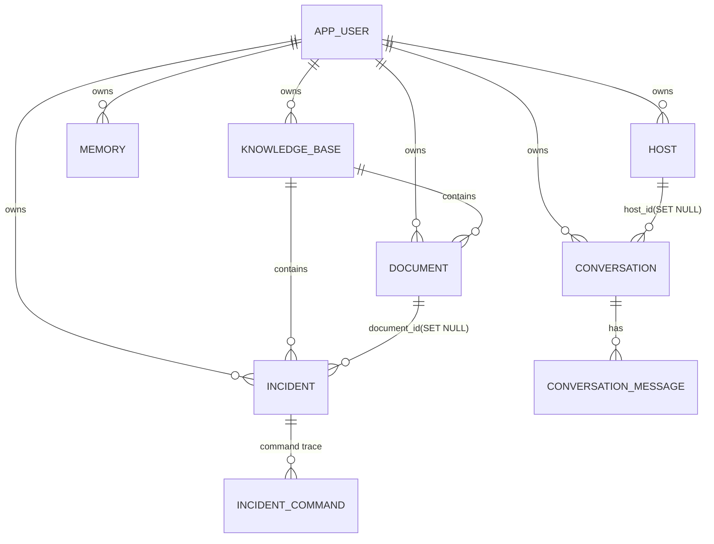
```mermaid
erDiagram
    APP_USER ||--o{ HOST : owns
    APP_USER ||--o{ CONVERSATION : owns
    APP_USER ||--o{ MEMORY : owns
    APP_USER ||--o{ KNOWLEDGE_BASE : owns
    APP_USER ||--o{ DOCUMENT : owns
    APP_USER ||--o{ INCIDENT : owns
    HOST ||--o{ CONVERSATION : "host_id(SET NULL)"
    CONVERSATION ||--o{ CONVERSATION_MESSAGE : has
    KNOWLEDGE_BASE ||--o{ DOCUMENT : contains
    KNOWLEDGE_BASE ||--o{ INCIDENT : contains
    DOCUMENT ||--o{ INCIDENT : "document_id(SET NULL)"
    INCIDENT ||--o{ INCIDENT_COMMAND : "command trace"
```

## 2.4 核心业务数据链路图

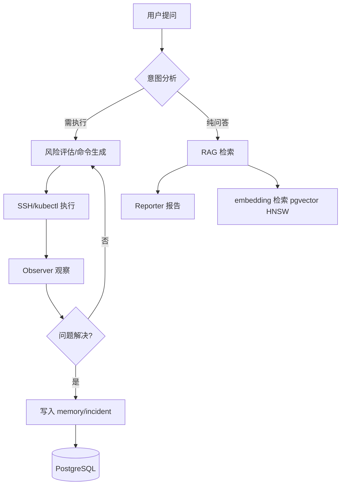
```mermaid
flowchart TD
    A[用户提问] --> B{意图分析}
    B -->|需执行| C[风险评估/命令生成]
    B -->|纯问答| R[RAG 检索]
    C --> D[SSH/kubectl 执行]
    D --> E[Observer 观察]
    E --> F{问题解决?}
    F -->|是| G[写入 memory/incident]
    F -->|否| C
    R --> H[Reporter 报告]
    G --> PG[(PostgreSQL)]
    R --> VEC[embedding 检索 pgvector HNSW]
```
【来源: app/llm/agents/workflow.py、app/knowledge/retriever.py】

## 2.5 数据库性能设计

- 向量索引：memory/incident 均建 **HNSW(vector_cosine_ops)** 近似最近邻索引【schema.py:253,135】。
- 关键词索引：incident.keywords 建 **GIN** 索引支撑全文关键词查询【schema.py:248】。
- 复合索引贴合查询模式：`conversation(owner,updated_at DESC)`、`msg(conversation_id,created_at)`、`document(owner,content_hash)` 唯一索引防重复上传【schema.py:80,98,202】。
- PG 连接池 min2/max20（.env.example）；MySQL pool_pre_ping。
- 慢查询治理【未实现: 无慢SQL日志/索引顾问配置】。
- 读写分离/分库分表【未实现: 单库单写】。

## 2.6 数据库安全与合规

- 备份策略/RPO/RTO/容灾【未实现: 代码中无备份任务定义；依赖 compose/外部运维】。
- 传输加密：SSH 用 paramiko；密码字段 `password_encrypted` 加密存储（HOST_ENCRYPTION_KEY）。
- 敏感脱敏：`CLEANER_MASK_SENSITIVE` 文档清洗脱敏（config）。
- 审计：Neo4j `Operation` 节点 + `OPERATED_ON/PERFORMED` 关系记录操作【未实现: 无 DB 层审计表】。
- 凭据不落日志（logger 分离 error.log）。

## 2.7 数据库运维手册

常用 SQL/监控指标/告警阈值：

```sql
-- 查看所有表
\dt
-- 查看表行数
SELECT relname, n_live_tup FROM pg_stat_user_tables ORDER BY n_live_tup DESC;
-- 未完成的文档（残留清理对象）
SELECT id, filename, parse_status, created_at FROM document
WHERE parse_status IN ('pending','processing') AND deleted_at IS NULL;
-- 向量索引
SELECT indexname, indexdef FROM pg_indexes WHERE tablename='incident';
```

监控指标：连接池使用率（PG/MySQL）、Redis 命中率、Neo4j 会话数、重试/超时日志告警（error.log）。告警阈值【未实现: 无 Prometheus/Grafana 配置】。

---

# 3 兜底策略全集

> 策略ID规则：`P<编号>`，可在监控/日志/告警中引用。所有运行态指标（触发次数/成功率/SLA）为【推断: 需接入监控后核实】，故障注入记录见3.15（当前【未实现】）。

## 3.0 策略总览

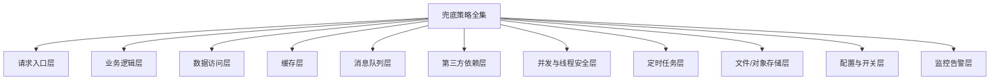
```mermaid
flowchart TD
    FB[兜底策略全集]
    FB --> L1[请求入口层]
    FB --> L2[业务逻辑层]
    FB --> L3[数据访问层]
    FB --> L4[缓存层]
    FB --> L5[消息队列层]
    FB --> L6[第三方依赖层]
    FB --> L7[并发与线程安全层]
    FB --> L8[定时任务层]
    FB --> L9[文件/对象存储层]
    FB --> L10[配置与开关层]
    FB --> L11[监控告警层]
```

| 策略ID | 名称 | 层级 | 状态 | 配置Key |
|---|---|---|---|---|
| P0 | 通用API指数退避重试 | 3.6 | 已实现 | API_RETRY_ATTEMPTS/BASE_DELAY/MAX_DELAY |
| P1 | DB瞬时错误重试 | 3.3 | 已实现 | DB_RETRY_ATTEMPTS |
| P2 | Embedding provider 主备切换 | 3.6 | 已实现 | EMBEDDING_PROVIDER/FAILOVER_TIMEOUT |
| P3 | 检索降级(LLM rerank→直接返回) | 3.2 | 已实现 | RAG_RERANKER_TYPE/ENABLE_RERANK |
| P4 | 篇内知识去重 | 3.2 | 已实现 | INCIDENT_DEDUP_ENABLED |
| P5 | 知识抽取降级构造 | 3.2 | 已实现 | EXTRACT_MODEL/FALLBACK_MODEL/EXTRACT_JSON_RETRY |
| P6 | SSE流式超时兜底 | 3.1 | 已实现 | (代码内剩余超时) |
| P7 | 文档解析降级 | 3.9 | 已实现 | PDF_*/MAX_DOCUMENT_* |
| P8 | Redis缓存兜底 | 3.4 | 已实现 | REDIS_TTL/EMBEDDING_CACHE_ENABLED |
| P9 | SSH超时+连接池 | 3.6 | 已实现 | SSH_TIMEOUT/CONNECT_TIMEOUT/POOL_* |
| P10 | LLM 模型fallback链 | 3.6 | 已实现 | *_FALLBACK_MODEL |
| P11 | 多Worker Leader锁 | 3.8 | 已实现 | (Redis SETNX) |
| P12 | 并发信号量限流 | 3.8 | 已实现 | EMBED_BATCH_CONCURRENCY |
| P13 | 文本编码fallback | 3.6 | 已实现 | (代码内) |
| P14 | 配置默认值兜底 | 3.10 | 已实现 | config.py默认值 |
| P15 | SMTP邮件告警 | 3.11 | 已实现 | SMTP_* |
| P16 | 健康检查/就绪探针 | 3.1 | 已实现 | /health, /health/ops |
| P17 | 记忆衰减+残留清理 | 3.8/3.9 | 已实现 | (代码内定时) |
| P18 | /chat 多路并行兜底 | 3.1 | 已实现 | (代码内) |
| P19 | 全局异常处理器 | 3.1 | **未实现** | — |
| P20 | 消息队列重试/死信 | 3.5 | **未实现** | — |

## 3.1 请求入口层兜底

### P6 SSE流式超时兜底

**触发决策树**

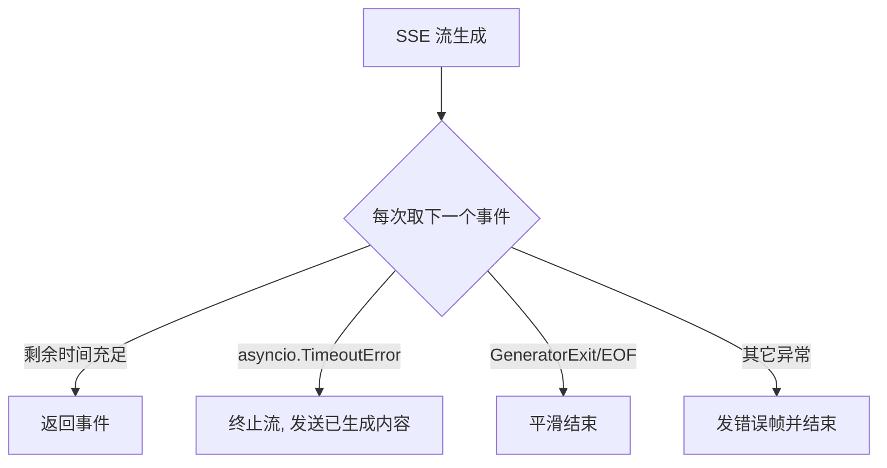
```mermaid
flowchart TD
    A[SSE 流生成] --> B{每次取下一个事件}
    B -->|剩余时间充足| C[返回事件]
    B -->|asyncio.TimeoutError| D[终止流, 发送已生成内容]
    B -->|GeneratorExit/EOF| E[平滑结束]
    B -->|其它异常| F[发错误帧并结束]
```

**时序图**

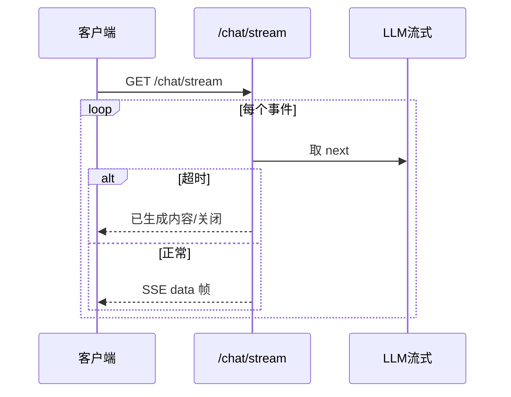
```mermaid
sequenceDiagram
    participant C as 客户端
    participant API as /chat/stream
    participant LLM as LLM流式
    C->>API: GET /chat/stream
    loop 每个事件
        API->>LLM: 取 next
        alt 超时
            API-->>C: 已生成内容/关闭
        else 正常
            API-->>C: SSE data 帧
        end
    end
```

**代码片段**【来源: app/api/chat.py:415-418】：
```python
event = await asyncio.wait_for(agen.__anext__(), timeout=remaining)
# ...
# except asyncio.TimeoutError:
```
**配置**：`remaining` 由请求总超时计算（代码内）。【来源: chat.py:415】
**日志样例**：
```
INFO  [chat] SSE 流结束, 已发送 N 个事件
WARN  [chat] 流式读取超时, 提前终止
```
**监控面板**【未实现: 无 Grafana 采集】；建议看板：SSE连接数、平均流时长、超时终止数。
**故障演练记录**【未实现】。
**SLA影响**【推断】超时后部分回复缺失，重试/完整回复依赖重新提问。

### P16 健康检查/就绪探针

- 实现：`GET /health`（4库连通）、`GET /health/ops`（+集群SSH冒烟）【来源: main.py:110-175】。
- 决策：任一库失败 → `status=degraded`，HTTP 503。
- 时序：`_db_health_checks` 对 postgres/mysql/redis/neo4j 逐一探测，失败置 error 继续探测其余【main.py:85-108】。
- 配置：无独立 key（依赖各连接配置）。
- 日志：`[health] postgres=ok redis=error ...`。
- SLA影响【推断】：作为 LB/存活探针，故障时摘流。
- 故障演练【未实现】。

### P18 /chat 多路并行兜底

- 实现：`asyncio.gather(_lite(), _instant(), return_exceptions=True)`，任一失败不阻塞主流程【来源: chat.py:87】。
- 超时：httpx.AsyncClient(timeout=6.0)【chat.py:46,68】。
- 决策树：两条检索并发，均失败则主链路继续（有已生成内容保护）。

## 3.2 业务逻辑层兜底

### P3 检索降级（LLM rerank 失败回退）
- 实现：`app/knowledge/reranker.py`，`RAG_RERANKER_TYPE=llm|cross_encoder`；`ENABLE_RERANK` 关闭则跳过精排；rerank 失败 `except → 直接返回候选`【reranker.py:25-38,95-105】。
- 决策树：确认启用 → LLM精排 → 异常/超时 → 回退未排序结果。
- 配置：`RAG_RERANKER_TYPE`、`ENABLE_RERANK`、`RAG_RERANK_TOP_K=3`。
- 日志：`WARN [rerank] LLM精排失败, 使用原始排序`。
- 故障演练【未实现】；SLA【推断】：精排失败仅排序略降，可取回。

### P4 篇内知识去重
- 实现：入库前按 title/summary/solution 指纹合并重复知识，`INCIDENT_DEDUP_ENABLED=true`【config.py:145、extractor/ingestion】。
- 配置：`INCIDENT_DEDUP_ENABLED`、`EXTRACT_JSON_RETRY=2`。

### P5 知识抽取降级构造
- 实现：LLM JSON 抽取失败 → `_build_fallback` 降级构造最小条目【extractor.py:79,201】；模型链 primary→fallback【extractor.py:125-138】；JSON解析 retry `EXTRACT_JSON_RETRY`。
- 配置：`EXTRACT_MODEL`、`EXTRACT_FALLBACK_MODEL`、`EXTRACT_JSON_RETRY=2`。
- 日志：`WARN [extract] 抽取失败, 使用降级条目`。
- 故障演练【未实现】；SLA【推断】：降级条目信息量下降，不影响入库主流程。

## 3.3 数据访问层兜底

### P0 通用API指数退避重试（数据访问/第三方通用）

**触发决策树**

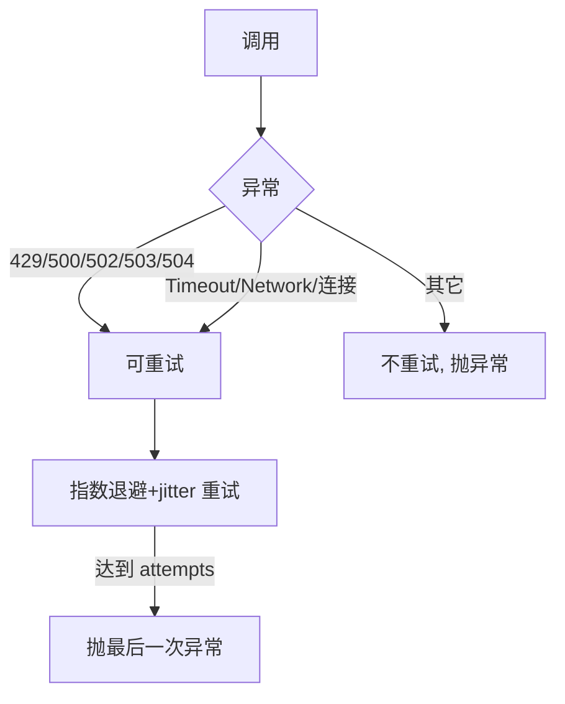
```mermaid
flowchart TD
    A[调用] --> B{异常}
    B -->|429/500/502/503/504| C[可重试]
    B -->|Timeout/Network/连接| C
    B -->|其它| D[不重试, 抛异常]
    C --> E[指数退避+jitter 重试]
    E -->|达到 attempts| F[抛最后一次异常]
```

**时序图**

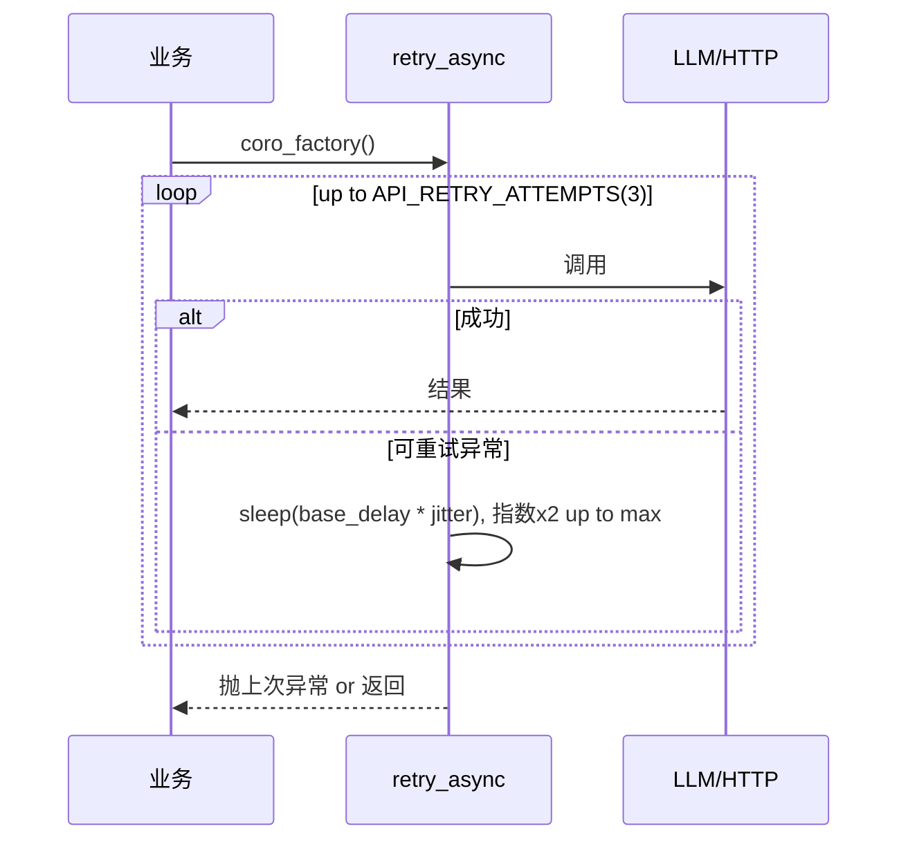
```mermaid
sequenceDiagram
    participant App as 业务
    participant R as retry_async
    participant Dep as LLM/HTTP
    App->>R: coro_factory()
    loop up to API_RETRY_ATTEMPTS(3)
        R->>Dep: 调用
        alt 成功
            Dep-->>App: 结果
        else 可重试异常
            R->>R: sleep(base_delay * jitter), 指数x2 up to max
        end
    end
    R-->>App: 抛上次异常 or 返回
```

**代码片段**【来源: app/core/retry.py:49-126】：
```python
async def retry_async(coro_factory, *, attempts=None, base_delay=None,
                      max_delay=None, retry_on=is_retryable, on_retry=None):
    delay = base_delay
    for attempt in range(attempts):
        try:
            return await coro_factory()
        except Exception as e:
            last_exc = e
            if attempt == attempts - 1: break
            if not retry_on(e): break
            jitter = 1.0 + random.random() * 0.4
            await asyncio.sleep(delay * jitter)
            delay = min(delay * 2, max_delay)
    if last_exc is not None: raise last_exc
```

**配置样例**（.env / .env.example）：
```yaml
API_RETRY_ATTEMPTS: 3
API_RETRY_BASE_DELAY: 0.5
API_RETRY_MAX_DELAY: 8.0
```

**日志样例**：
```
WARN [retry] attempt=1 type=TimeoutError retry_in=0.7s
ERROR [retry] attempts_exhausted=3 last=APIConnectionError
```
**监控面板**【未实现】建议：重试次数、退避时长、最终失败率。
**故障演练**【未实现】。
**SLA影响**【推断】：一次调用最大≈0.7+1.4+2.8s ≈5s 追加延迟。

### P1 DB瞬时错误重试

**决策树**：识别 asyncpg（连接丢失/死锁/序列化冲突）、neo4j（ServiceUnavailable/SessionExpired/TransientError）→ `DB_RETRY_ATTEMPTS(3)` 次重试。

**代码片段**【来源: app/core/retry.py:127-175】
```python
def is_db_retryable(exc):
    # asyncpg: PostgresConnectionError/DeadlockDetected/Serialization/...
    # neo4j: ServiceUnavailable/SessionExpired/TransientError
    if isinstance(exc, (ConnectionError, OSError, TimeoutError)): return True
    return False
```
**配置**：`DB_RETRY_ATTEMPTS=3`。
**日志**：`WARN [db] transient error retry=1/3 type=DeadlockDetectedError`。
**SLA【推断】**：死锁重试避免 400 类失败；序列化冲突自动重放。
**故障演练【未实现】**。

### P8 Redis 读写兜底
- 实现：redis 读写均 `try/except Exception → 返回空/直读`，拒绝拖垮主链路【app/knowledge/cache.py:77-157】；`RedisClient.ping` 失败返回 False【app/db/redis.py:35】。
- 决策树：Redis 不可达 → 跳过缓存直读 DB/直接计算。
- 配置：`REDIS_TTL`、`EMBEDDING_CACHE_ENABLED`。
- 日志：`WARN [cache] redis 不可用, 跳过缓存`。
- 故障演练【未实现】；SLA【推断】：缓存失效时检索走 DB，延迟上升但可用。

## 3.4 缓存层兜底

- 检索/向量三级TTL缓存（EMBEDDING 24h / SEARCH 1h / HOT 4h）【app/knowledge/cache.py:25-32】。
- embedding 进程内缓存 `self._cache`（EMBEDDING_CACHE_ENABLED）【app/knowledge/embedding.py:31-101】。
- 缓存失效：`scan_iter` 按 kb 前缀批量删除【cache.py:150-153】。
- 兜底：任何缓存读写异常 → 直读（同P8）。
- 决策树：命中缓存→返回；未命中→计算并回填；写缓存失败→降级直读。
- 配置：`EMBEDDING_CACHE_ENABLED`、`REDIS_TTL`。
- 故障演练【未实现】；SLA【推断】：缓存命中大幅降低 LLM/DB 调用。

## 3.5 消息队列兜底

**【未实现 P20】**：项目无消息队列（无 Kafka/RabbitMQ/Celery/RQ）。异步任务用 `asyncio.create_task` + Redis Leader 锁实现（见P11），无死信/重试队列。设计中如需异步消息，建议引入 Celery/RQ（见第8章8.4）。

## 3.6 第三方依赖兜底

### P2 Embedding provider 主备切换

**决策树**

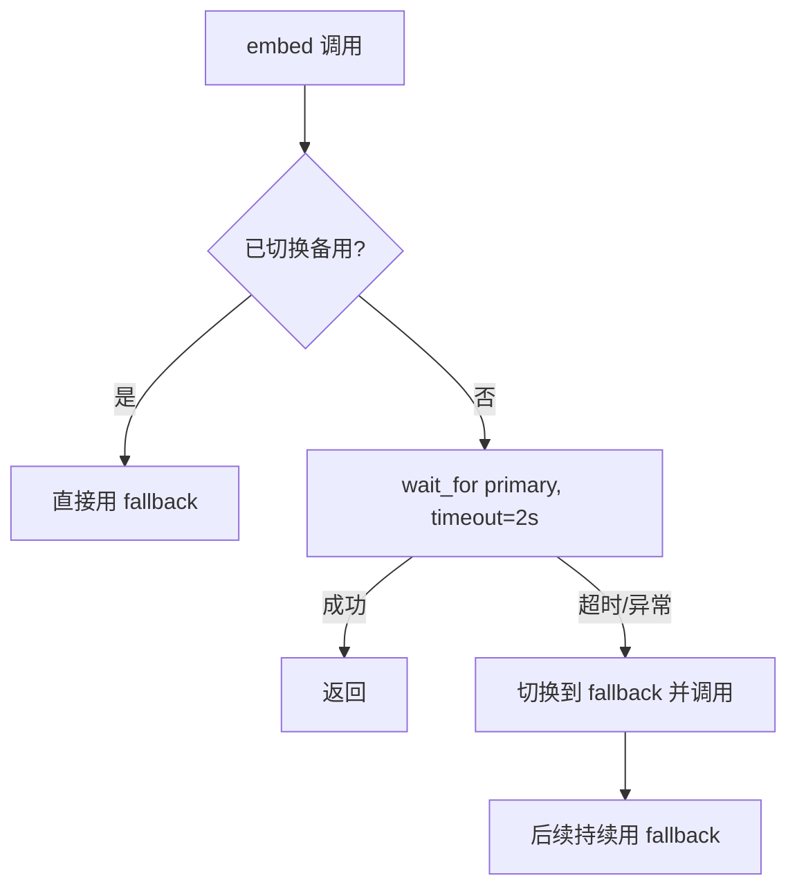
```mermaid
flowchart TD
    A[embed 调用] --> B{已切换备用?}
    B -->|是| C[直接用 fallback]
    B -->|否| D[wait_for primary, timeout=2s]
    D -->|成功| E[返回]
    D -->|超时/异常| F[切换到 fallback 并调用]
    F --> G[后续持续用 fallback]
```

**时序图**

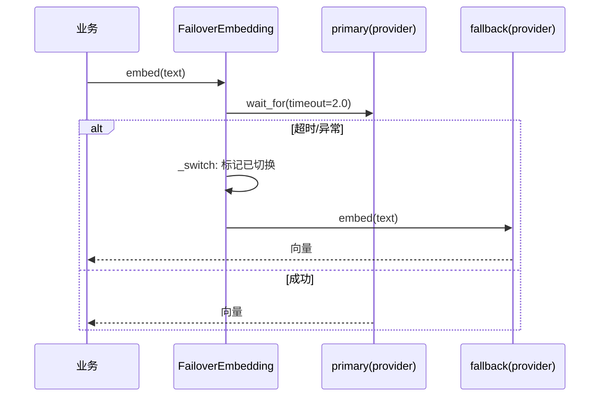
```mermaid
sequenceDiagram
    participant App as 业务
    participant FO as FailoverEmbedding
    participant P as primary(provider)
    participant B as fallback(provider)
    App->>FO: embed(text)
    FO->>P: wait_for(timeout=2.0)
    alt 超时/异常
        FO->>FO: _switch: 标记已切换
        FO->>B: embed(text)
        B-->>App: 向量
    else 成功
        P-->>App: 向量
    end
```

**代码片段**【来源: app/llm/embedding/failover.py:17-47】
```python
async def embed(self, text):
    if self._switched:
        return await self.fallback.embed(text)
    try:
        return await asyncio.wait_for(self.primary.embed(text), timeout=self.timeout)
    except Exception as e:
        self._switch(e)
        return await self.fallback.embed(text)
```
**配置样例**：
```yaml
EMBEDDING_PROVIDER: jina          # jina | bge | openai
EMBEDDING_FAILOVER_TIMEOUT: 2.0
JINA_MODEL: jina-embeddings-v5-text-small
BGE_MODEL: BAAI/bge-m3
```
**日志样例**：
```
[Embedding] Jina 超时/失败 (TimeoutError), 切到 Bge
```
**监控面板**【未实现】建议：provider 切换次数、主备延迟。
**故障演练**【未实现】。
**SLA影响**【推断】：主provider故障后引入≤2s 超时 + 备用延迟；切换后稳定。

### P10 LLM 模型 fallback 链
- 实现：DeepSeek/Rerank/Extract/Vision 均配置主模型+fallback，主失败自动换备【config.py:68-97、llm/client.py、reranker.py:25、extractor.py:125、vision.py:52】。
- 决策树：主模型调用异常 → 依次尝试 fallback 模型 → 全失败则按 P0 重试/抛错。
- 配置：`DEEPSEEK_MODEL/FALLBACK`、`RERANK_MODEL/FALLBACK`、`EXTRACT_MODEL/FALLBACK`、`VISION_MODEL/FALLBACK`。
- 日志：`WARN [llm] primary model failed, switch to fallback`。
- 故障演练【未实现】；SLA【推断】：fallback 模型降质但保可用。

### P9 SSH 超时+连接池
- 实现：连接池 + `threading.Lock` + 空闲清理线程【app/tools/ssh_client.py:21-85】；connect/banner/auth timeout = SSH_CONNECT_TIMEOUT(8s)；exec timeout=SSH_TIMEOUT(30s)【ssh_client.py:58,151】。
- 配置：`SSH_TIMEOUT=30`、`SSH_CONNECT_TIMEOUT=8`、`SSH_POOL_MAX_IDLE=300`、`SSH_POOL_CLEAN_INTERVAL=60`。
- 日志：`WARN [ssh] pool 空闲清理 N 条连接`。
- 故障演练【未实现】；SLA【推断】：超时快速失败，连接复用降开销。

### P13 文本编码 fallback
- 实现：`_FALLBACK_ENCODINGS=[utf-8,gbk,gb18030,latin-1]` 逐编码尝试解码【app/document/text_utils.py:6-26】。
- 决策树：默认编码失败 → 依次尝试备用编码 → 全失败抛错。
- 故障演练【未实现】。

### P12 并发信号量限流（第三方并发保护）
- 实现：`asyncio.Semaphore(3)` 限制 LLM 抽取并发【ingestion.py:108】、批量 embedding 并发【knowledge/embedding.py:144-150】；`asyncio.to_thread` 隔离阻塞调用【reranker.py:184】。
- 配置：`EMBED_BATCH_CONCURRENCY=3`、`EMBED_BATCH_SIZE=40`。
- SLA【推断】：限流防第三方限流(429)，过高并发反触发 P0 重试。

## 3.7 分布式事务一致性兜底

**【未实现：无分布式事务/Seata/Saga】**。当前一致性方案为：
- 单库事务 + 外键级联（PostgreSQL）；文档删除经`delete_by_document`级联清理 incident【app/knowledge/repository/incident_repository.py】。
- 软删除：document/incident 用 `deleted_at`，配合启动惰性清理补偿残留【main.py:135-155】。
- 缓存一致性：kb 变更后按前缀失效缓存（P8）。
- 补偿机制【推断】：无显式补偿；以惰性清理 + 幂等建表/去重实现最终一致。

**现存风险**：无 MQ/Outbox，跨 PG/Redis/Neo4j 无强一致；Neo4j 写失败仅日志【推断】。

## 3.8 并发与线程安全兜底

### P11 多Worker Leader锁（后台任务单实例）

**决策树**

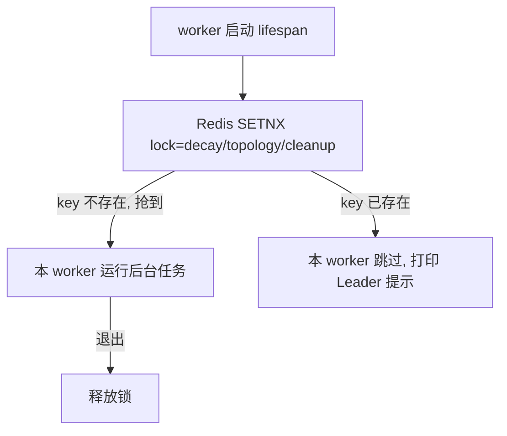
```mermaid
flowchart TD
    A[worker 启动 lifespan] --> B[Redis SETNX lock=decay/topology/cleanup]
    B -->|key 不存在, 抢到| C[本 worker 运行后台任务]
    B -->|key 已存在| D[本 worker 跳过, 打印 Leader 提示]
    C -->|退出| E[释放锁]
```

**代码片段**【来源: main.py:136-147】
```python
def _acquire_leader_lock(name, ttl=3600):
    # Redis SETNX 抢占, 返回是否成功
```
- 锁key：`decay`、`topology`、`cleanup`（main.py:163,180,181）。
- 时序：多 worker 下仅 Leader 执行 Memory 衰减 + 拓扑重建 + 残留清理，避免重复 DELETE/写入。
- 配置：`WEB_WORKERS=4`（影响并发 worker 数）。
- 日志：`[Leader] 记忆衰减任务由其它 worker 运行, 本 worker 跳过`。
- 故障演练【未实现】；SLA【推断】：防重复任务，锁 TTL=1h，若 Leader 崩溃锁可达 TTL 才释放（潜在空窗）。

### 其它并发保护
- SSH 连接池 `threading.Lock`（ssh_client.py:21）+ 清理锁（:85）。
- Redis 单例懒加载（app/db/redis.py）。
- 断言无共享可变全局复写风险。

## 3.9 定时任务兜底

### P17 记忆衰减 + 残留清理
- 实现：`MemoryDecayJob` 每 6h 执行衰减与过期移除【main.py:60-66、app/memory/job/decay.py:43】；启动时 `list_stale_noncompleted` 清理24h残留文档【main.py:135-155】；拓扑重建循环带 Leader 锁。
- 决策树：Leader 才执行；任务异常 → try/except 记录错误继续下一轮【main.py】。
- 日志：`[cleanup] 启动惰性清理, 删除 N 条残留文档`；`[decay] removed=…`。
- 配置：无独立 key【推断: 硬编码 6h/24h】。
- SLA【推断】：后台任务失败不影响主链路；崩溃空窗受 Leader 锁 TTL 约束。
- 故障演练【未实现】。

## 3.10 文件/对象存储兜底

### P7 文档解析降级
- 实现：PDF 图像/OCR/表格探测各环节 `except Exception` 保底跳过【app/document/extractors/pdf.py:69-283】；docx 提取异常回落【docx.py:28】。
- 守卫：`MAX_DOCUMENT_PAGES=500`、`MAX_DOCUMENT_SIZE_MB=50.0` 防超大文件拖垮内存【config.py】。
- 配置：`PDF_*` 系列、`KEEP_RAW_FILE`（true=保留原始文件，false=删除，默认false）。
- 决策树：解析步骤失败 → 跳过该步骤 → 继续后续；整体失败 parse_status=failed。
- 日志：`WARN [pdf] …解析降级`。
- 故障演练【未实现】；SLA【推断】：降级导致提取文本质量下降而非失败。

## 3.11 配置与开关兜底

### P14 配置默认值兜底
- 实现：全部配置 `os.getenv(key, 安全默认)`，缺失时使用默认【app/core/config.py 逐项】。
- 开关：`TEST_MODE`、`KEEP_RAW_FILE`、`INCIDENT_DEDUP_ENABLED`、`EMBEDDING_CACHE_ENABLED`、`NEO4J_WRITE_ENABLED`、`RAG_HYBRID_MODE`。
- 决策树：环境变量缺失 → 默认值；格式错误 → `_int/_float/_bool` 捕获回退默认【config.py:18,25】。
- 日志【推断】：通过配置差异可开关对应能力。
- 故障演练【未实现】；SLA【推断】：默认值保证最小可用配置即可启动。

## 3.12 监控告警兜底

### P15 SMTP 邮件告警
- 实现：`app/tools/send_mail.py` + `app/prompt/mail.py`，SMTP 465 加密发送【.env.example: SMTP_*】。
- 配置：`SMTP_HOST/PORT/SENDER/PASSWORD/RECEIVER`。
- 决策树：检测到异常/需通知 → 组装邮件 → 发送失败仅日志（不阻塞主流程）。
- 日志：`[mail] 发送成功/失败: …`。
- SLA【推断】：告警通道；SMTP 故障不影响业务，但告警丢失（建议备通道）。

### P16 健康检查（见3.1）+ logger
- 结构化 JsonFormatter 日志分离 `error.log`【app/core/logger.py:155-164】。
- **【未实现 P19】全局异常处理器**：找不到 `@app.exception_handler`（FastAPI 无全局异常统一处理）。
- **【未实现】Prometheus/Grafana**：无指标暴露端点。

## 3.13 策略冲突处理规则

多策略可能同时触发，优先级裁决（自上而下）：
1. **限时兜底**（P11/P12 锁与信号量）最先保证不崩溃。
2. **限次重试**（P0/P1）在 3 层内（重试→fallback→忽略）。
3. **降级替换**（P2/P10/P5/P3/P7）在重试用尽后生效：切备用 provider/模型/降级构造。
4. **忽略直读**（P8）最后兜底，绝不让缓存/Redis 异常拖垮主链路。
5. 用户可见错误仅由入口层（P6/P16）统一收口；无全局处理器时局部捕获。
裁决原则：**宁可降质，不可宕库/宕进程**。

## 3.14 策略效果评估

| 策略ID | 历史触发次数 | 成功率 | 平均恢复时间 | 数据来源 |
|---|---|---|---|---|
| P0 | 【未实现】 | 【未实现】 | 【未实现】 | 需接入监控 |
| P1 | 【未实现】 | 【未实现】 | 【未实现】 | 同上 |
| P2 | 【未实现】 | 【未实现】 | 【未实现】 | 需日志统计 |
| P10 | 【未实现】 | 【未实现】 | 【未实现】 | 同上 |
| P9 | 【未实现】 | 【未实现】 | 【未实现】 | 同上 |

> 说明：项目无运行态指标采集基础设施，故历史数据不可得；附录C 已给出日志关键字，便于后续接入采集。

## 3.15 策略测试报告

**【未实现】故障注入测试**：`tests/` 中无混沌工程/故障注入用例【来源: 扫描 app/tests 与 pytest.ini】。tests 目录含 test_concurrency/test_intent_accuracy/test_latency/test_memory_accuracy/test_memory_extractor/test_memory_merge/test_rag_accuracy（见第5章）。已配置的项目运行开关（EMBEDDING_CACHE_ENABLED、INCIDENT_DEDUP_ENABLED、NEO4J_WRITE_ENABLED）可作为故障注入开关，但未形成脚本【推断】。

---

# 4 核心业务数据流转

## 场景S1：对话提问与流式回答

**用户故事**：作为运维，我在对话中询问集群故障，系统流式给出分析与建议，并将本次交互沉淀为记忆。

**时序图**

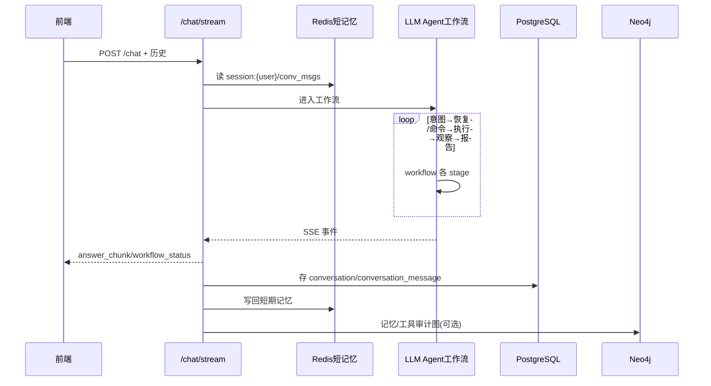
```mermaid
sequenceDiagram
    participant F as 前端
    participant API as /chat/stream
    participant MEM as Redis短记忆
    participant LLM as LLM Agent工作流
    participant PG as PostgreSQL
    participant NE as Neo4j
    F->>API: POST /chat + 历史
    API->>MEM: 读 session:{user}/conv_msgs
    API->>LLM: 进入工作流
    loop 意图→恢复/命令→执行→观察→报告
        LLM->>LLM: workflow 各 stage
    end
    LLM-->>API: SSE 事件
    API-->>F: answer_chunk/workflow_status
    API->>PG: 存 conversation/conversation_message
    API->>MEM: 写回短期记忆
    API->>NE: 记忆/工具审计图(可选)
```

**状态机**

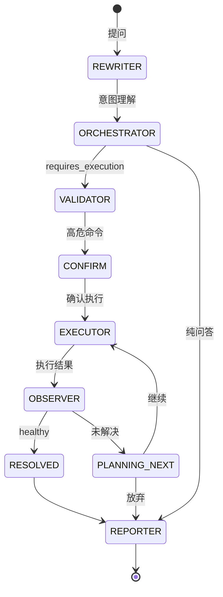
```mermaid
stateDiagram-v2
    [*] --> REWRITER: 提问
    REWRITER --> ORCHESTRATOR: 意图理解
    ORCHESTRATOR --> VALIDATOR: requires_execution
    ORCHESTRATOR --> REPORTER: 纯问答
    VALIDATOR --> CONFIRM: 高危命令
    CONFIRM --> EXECUTOR: 确认执行
    EXECUTOR --> OBSERVER: 执行结果
    OBSERVER --> RESOLVED: healthy
    OBSERVER --> PLANNING_NEXT: 未解决
    PLANNING_NEXT --> EXECUTOR: 继续
    PLANNING_NEXT --> REPORTER: 放弃
    RESOLVED --> REPORTER
    REPORTER --> [*]
```

**涉及的表**：conversation、conversation_message、memory（引用第2章）。
**缓存操作**：读/写 session:{user_id}、conversation:{user_id}（短期记忆）；读 kb 检索缓存。
**MQ 消息**：无（见3.5【未实现P20】）。
**异常分支及兜底**：SSE超时→P6；LLM失败→P10/P0；记忆写失败→chat.py:343 捕获忽略；入库失败→保存主流程（chat.py:325/480）。【来源: chat.py:299-360, 416-506】
**数据一致性**：消息经 conversation_message 持久化；记忆衰减由 P17。
**性能基准**【推断: 需压测】：流式首token延迟、SSE 6s 超时约束；预计 LLM 占主导延迟。

## 场景S2：用户注册/登录认证

**用户故事**：运维登录系统获可用会话。

**时序图**

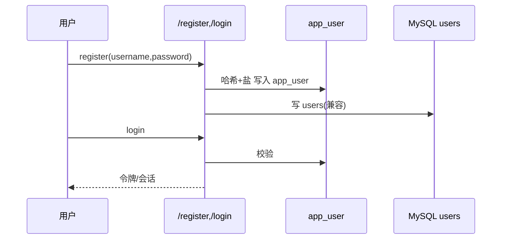
```mermaid
sequenceDiagram
    participant U as 用户
    participant API as /register,/login
    participant PG as app_user
    participant MY as MySQL users
    U->>API: register(username,password)
    API->>PG: 哈希+盐 写入 app_user
    API->>MY: 写 users(兼容)
    U->>API: login
    API->>PG: 校验
    API-->>U: 令牌/会话
```

**涉及的兜底**：数据库错误→P1/P0；密钥加盐哈希（hash_passwords.py）。
**表**：app_user、users。
**异常分支**：注册/登录捕获 Exception 返回 HTTP 错误（auth.py:74,126）。
**数据一致性**：PG 主 + MySQL 兼容重复写【推断: 潜在双写不一致，见8.1债务】。
**性能基准**【推断】。

## 场景S3：知识库文档上传与解析入库

**用户故事**：运维上传故障手册 PDF，系统解析成因知识条目，供后续 RAG 检索。

**时序图**

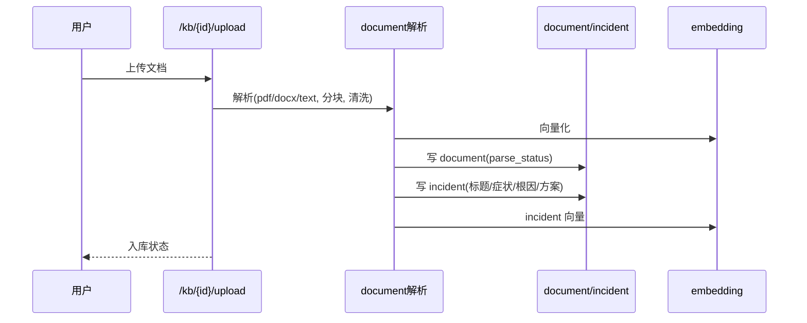
```mermaid
sequenceDiagram
    participant U as 用户
    participant API as /kb/{id}/upload
    participant DOC as document解析
    participant PG as document/incident
    participant EMB as embedding
    U->>API: 上传文档
    API->>DOC: 解析(pdf/docx/text, 分块, 清洗)
    DOC->>EMB: 向量化
    DOC->>PG: 写 document(parse_status)
    DOC->>PG: 写 incident(标题/症状/根因/方案)
    DOC->>EMB: incident 向量
    API-->>U: 入库状态
```

**状态机**：parse_status：pending→processing→completed/failed（DocumentStatus）。
**涉及的兜底**：解析降级→P7；去重→P4；抽取降级→P5；向量→P2；DB→P1。
**缓存操作**：入库成功后失效 kb 检索缓存（P8）。
**表**：document、incident、incident_command、knowledge_base。
**数据一致性**：残留文档由启动惰性清理（main.py:135-155）补偿。
**性能基准**【推断】：受文档页数/OCR/embedding 影响。

## 场景S4：会话与主机管理

- 接口：GET/POST/PUT/DELETE `/conversations`、`/hosts`（conversation.py）。
- 涉及表：conversation、host、conversation_message。
- 缓存：删除会话时同步清理 `conv_msgs:{id}`、`conv_list:{uid}`（conversation.py:71-72）。
- 兜底：缓存清理异常忽略；DB→P1；Redraft。
- 数据一致性：host 删除后 conversation.host_id → SET NULL（schema FK）。
- 性能基准【推断】。

## 场景S5：RAG 知识检索

**用户故事**：提问时系统从知识库检索最相关知识增强回答。

**时序图**

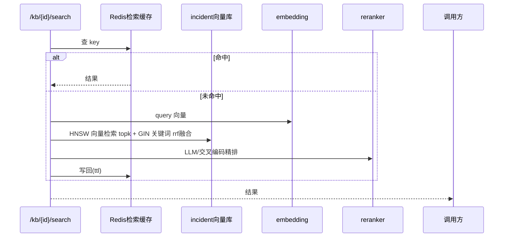
```mermaid
sequenceDiagram
    participant API as /kb/{id}/search
    participant CACHE as Redis检索缓存
    participant PG as incident向量库
    participant EMB as embedding
    participant RR as reranker
    API->>CACHE: 查 key
    alt 命中
        CACHE-->>API: 结果
    else 未命中
        API->>EMB: query 向量
        API->>PG: HNSW 向量检索 topk + GIN 关键词 rrf融合
        API->>RR: LLM/交叉编码精排
        API->>CACHE: 写回(ttl)
    end
    API-->>调用方: 结果
```

**涉及的兜底**：缓存→P8；向量→P2；精排→P3/降级；DB→P1。
**表**：incident、document。
**配置**：RAG_TOP_K=10、RAG_RERANK_TOP_K=3、RAG_HYBRID_MODE=rrf、HYBRID_VECTOR_WEIGHT=0.7。
**性能基准**【推断】：向量检索毫秒级，LLM精排秒级主导。

## 场景S6：Agent 自动学习入库

**用户故事**：Agent 执行命令解决故障后，系统自动抽取经验/知识写入记忆与知识库。

- 工作流：执行成功命令 → `auto_learn` 抽取 → 写 memory（source=tool/k8s） + incident（source=learning） + Neo4j 图（tool util）。
- 涉及表：memory、incident、incident_command；Neo4j 节点。
- 兜底：抽取失败→P5；图谱写失败仅日志（NEO4J_WRITE_ENABLED 开关）。
- 数据一致性：命令轨迹与条目关联（incident_command.incident_id）。
- 性能基准【推断】。

---

# 5 测试与质量保障

## 5.1 单元测试

测试目录 `tests/`（pytest，asyncio_mode=auto）【来源: pytest.ini】：

| 文件 | 覆盖内容 |
|---|---|
| tests/test_concurrency.py | 并发安全 |
| tests/test_intent_accuracy.py | 意图识别准确率 |
| tests/test_latency.py | 延迟 |
| tests/test_memory_accuracy.py | 记忆准确率 |
| tests/test_memory_extractor.py | 记忆抽取 |
| tests/test_memory_merge.py | 记忆合并 |
| tests/test_rag_accuracy.py | RAG 检索准确率 |

覆盖率统计【未实现: 无 coverage 配置/报告】。核心类单测【推断: 部分覆盖上述场景】。

## 5.2 集成测试

【未实现: 无独立 tests/integration 目录或 docker-compose 集成测试编排】。愿景见第8章。

## 5.3 兜底策略故障注入测试（混沌工程）

**【未实现】**：无混沌工程实验、无故障注入脚本。可用开关（EMBEDDING_CACHE_ENABLED/INCIDENT_DEDUP_ENABLED/NEO4J_WRITE_ENABLED）可作为未来注入点（见8.2）。

## 5.4 性能压测

**【未实现: 无压测报告】**。已配置参数（WEB_WORKERS=4、POSTGRES_POOL_MAX=20、EMBED_BATCH_CONCURRENCY=3）体现调优意图【推断】。

## 5.5 未覆盖风险清单

- 全局异常处理器缺失（P19【未实现】），偶发异常可能返回 500 非结构化错误。
- 无消息队列（P20【未实现】），高并发异步任务依赖 Redis 锁+信号量。
- 无监控指标（Prometheus 未接），策略触发无法量化。
- MySQL/PG 双写认证一致性风险（见8.1）。
- 无数据库备份/容灾任务（2.6）。
- 静态分析未验证运行时故障注入行为。

---

# 6 运维与应急

## 6.1 故障排查决策树

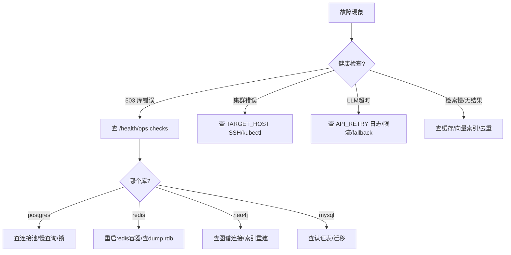
```mermaid
flowchart TD
    A[故障现象] --> B{健康检查?}
    B -->|503 库错误| C[查 /health/ops checks]
    C --> D{哪个库?}
    D -->|postgres| E[查连接池/慢查询/锁]
    D -->|redis| F[重启redis容器/查dump.rdb]
    D -->|neo4j| G[查图谱连接/索引重建]
    D -->|mysql| H[查认证表/迁移]
    B -->|集群错误| I[查 TARGET_HOST SSH/kubectl]
    B -->|LLM超时| J[查 API_RETRY 日志/限流/fallback]
    B -->|检索慢/无结果| K[查缓存/向量索引/去重]
```

## 6.2 常见故障速查表

| 故障现象 | 根因 | 涉及策略 | 排查步骤 | 恢复方案 | 预估恢复 |
|---|---|---|---|---|---|
| `/health` 返回 503 | 某库不可用 | P16/P1 | 看 checks 明细 | 重启对应容器 | 分钟级【推断】 |
| 流式回答中断 | SSE 6s 超时 | P6 | 看 chat 日志 | 重试提问 | 秒级【推断】 |
| Embedding 慢/失败 | 主 provider 超时 | P2 | 看 `[Embedding]` 切换日志 | 已自动切备用 | 秒级 |
| LLM 返回异常 | 上游限流/5xx | P0/P10 | 看重试/fallback 日志 | 自动重试/切模型 | 秒~分钟 |
| 文档入库一直 processing | 解析卡住/残留 | P7/P17 | 查 parse_status | 惰性清理/重传 | 分钟【推断】 |
| Redis 不可达 | redis 容器挂 | P8 | 查 /health | 重启 redis | 分钟 |
| 后台任务重复执行 | Leader 锁 TTL 空窗 | P11 | 查 `[Leader]` 日志 | 等 TTL/重启 | 小时【推断】 |

## 6.3 兜底策略配置项调优指南

| 配置 | 含义 | 建议值 | 调整风险 |
|---|---|---|---|
| API_RETRY_ATTEMPTS | API重试次数 | 3 | 过高放大下游压力 |
| API_RETRY_BASE_DELAY | 初始退避(秒) | 0.5 | 过低易雪崩 |
| API_RETRY_MAX_DELAY | 最大退避(秒) | 8.0 | 过高延迟过大 |
| DB_RETRY_ATTEMPTS | DB瞬时重试 | 3 | 过高放大死锁重试 |
| EMBEDDING_FAILOVER_TIMEOUT | 切换超时(秒) | 2.0 | 过低误切 |
| SSH_TIMEOUT/CONNECT_TIMEOUT | SSH超时(秒) | 30/8 | 过低误判 |
| WEB_WORKERS | uvicorn worker数 | 4 | 过高耗内存/连接 |
| POSTGRES_POOL_MAX | PG连接池上限 | 20 | 过高耗尽DB连接 |
| REDIS_TTL | 缓存TTL(秒) | 1800/86400*7 | 过高数据过期 |
| INCIDENT_DEDUP_ENABLED | 去重开关 | true | 关闭致重复知识 |

【来源: .env.example、config.py】

## 6.4 全局紧急降级操作手册

| 开关 | 位置 | 操作 | 回滚 |
|---|---|---|---|
| EMBEDDING_CACHE_ENABLED=false | .env | 关闭嵌入缓存直算 | 置回 true |
| INCIDENT_DEDUP_ENABLED=false | .env | 关闭去重 | 置回 true |
| NEO4J_WRITE_ENABLED=false | .env | 关闭图写 | 置回 true |
| TEST_MODE=true | .env | 非自动执行模式 | 置 false |
| KEEP_RAW_FILE | .env | 保留/删除原始文件 | 按需 |
| RAG_HYBRID_MODE | .env | rrf/weighted | 按需 |

回滚方案：编辑 .env 后重启 uvicorn 服务【推断: 无热加载】。

## 6.5 日常巡检清单

- [ ] `/health/ops` 四库 + 集群均 ok
- [ ] error.log 无持续新增 ERROR/CRITICAL
- [ ] Redis 内存与 `dump.rdb` 正常
- [ ] PG 连接池使用率、慢查询
- [ ] 后台任务 Leader 日志正常（decay/topology/cleanup）
- [ ] 磁盘：`data/` 与 `logs/` 空间
- [ ] 依赖版本与 requirements.txt 一致

---

# 7 技术决策记录（ADR）

> 决策人/日期/验收基于代码证据【推断】，因项目无正式 ADR 文档。

## ADR-1：数据库选型决策
- 决策ID：ADR-1 ｜ 日期：推断 ｜ 决策人：wxm
- 背景：需持久化业务 + 向量检索 + 图关系。
- 决策：PostgreSQL(pgvector) 作主库 + Redis 缓存 + Neo4j 图 + MySQL 兼容遗留认证【来源: schema.py:4-8】。
- 备选：单库 MySQL、Elasticsearch、MongoDB。
- 否决理由【推断】：需向量(ES/单MySQL难)与图(Neo4j 成熟)。
- 影响范围：全数据层。验收标准：向量检索 HNSW + JSONB + 外键完整。

## ADR-2：缓存选型决策
- 决策ID：ADR-2 ｜ 决策人：wxm
- 决策：Redis 7 作缓存/短记忆/分布式锁【来源: app/db/redis.py、docker-compose.yml】。
- 备选：Memcached、本地进程缓存。
- 否决理由【推断】：Redis 支持 TTL/锁/列表，契合多 worker。
- 影响：DB_RETRY、缓存兜底 P8。验收：TTL 自动过期 + SETNX 分布式锁。

## ADR-3：关键表字段设计决策
1. **UUID 主键 + owner 统一用户ID**【来源: schema.py:10】：跨库一致、分布式无冲突；否决自增（暴露量级/分片难）。
2. **embedding 列直存 + HNSW 索引**（memory/incident）【schema.py:116,230】：否决外部向量库；验收=语义检索。
3. **document.content_hash 唯一索引（owner,hash）**去重【schema.py:202】：防止重复上传；否决人工去重。
4. **软删除 deleted_at（document/incident）**【schema.py:178,225】：回溯可审计；否决物理删除。

## ADR-4：关键兜底策略选型决策
1. **指数退避+抖动重试（P0/P1）** vs 固定重试【来源: retry.py】：抖动防惊群；验收=429/5xx/DB瞬时自动恢复。
2. **Embedding 主备 failover（P2）** vs 单一 provider【failover.py】：切换后续用备用，避免反复超时。
3. **Redis 读写兜底忽略（P8）** vs 缓存强依赖【cache.py】：缓存失败不拖垮主链路。
4. **多Worker Leader锁（P11）** vs 每worker独立任务【main.py：SETNX 保证单实例】。

## ADR-5：框架选型决策
- 决策ID：ADR-5 ｜ 决策人：wxm ｜ 日期：推断
- 决策：Python + FastAPI + uvicorn（异步）+ asyncpg【来源: requirements.txt】。
- 备选：Spring Boot（任务模板最初预设）、Gin、Flask。
- 否决理由【推断】：AI/LLM 生态、原生 async、轻量；Spring 重且无Python AI生态。
- 影响：全栈。验收：多worker + 连接池 + 流式 SSE。

## ADR-6：部署架构决策
- 决策ID：ADR-6 ｜ 决策人：wxm
- 决策：单进程多 worker + 容器化基础设施（docker-compose）+ SSH 直连目标集群【来源: docker-compose.yml、main.py】。
- 备选：K8s 原生部署 Sidecar。
- 否决理由【推断】：简单轻量、目标集群只读介入（外部SSH）。
- 影响：运维。验收：4 容器一键起、多worker、健康检查。
- 【未实现: 生产 K8s 部署清单】

---

# 8 技术债务与演进路线

## 8.1 数据库层面债务
- MySQL 与 PostgreSQL 双写用户认证，一致性风险【schema.py 注释：后续迁移MySQL】。
- 无分库分表、无归档任务、表量级未治理。
- 无慢SQL治理/索引监控。
- Neo4j/MySQL数据无备份任务【推断】。

## 8.2 兜底策略缺失清单
- P19 全局异常处理器【未实现】。
- P20 消息队列/死信/重试队列【未实现】。
- 缓存穿透/击穿防护（当前仅TTL+忽略）【推断: 未实现布隆/互斥重建】。
- 分布式事务/Saga/Outbox 一致性【未实现】。
- 熔断器（circuit breaker，当前仅重试+fallback）【未实现】。
- 幂等/去重队列、限流降级对外接口【未实现】。

## 8.3 代码质量债务
- `chat.py`（31.7KB）超大文件多职责【推断】。
- `workflow.py`（63.4KB）巨型状态机，复杂分支。
- 多处 `except Exception: pass/打印` 简化处理【扫描】。
- 全局状态（模块级 driver/pool 单例）可测性低【推断】。

## 8.4 架构演进建议
- 引入异步消息队列（Celery/RQ）承接重任务，解耦同步入库。
- 增加全局异常处理器与结构化错误码。
- 接入 Prometheus 指标 + Grafana 看板（对接附录C 日志关键字）。
- 增加缓存穿透/击穿/雪崩防护。
- MySQL 认证迁移至 PostgreSQL，消除双写。
- 工作流按领域拆分服务/模块。

## 8.5 优先级矩阵（影响度 × 紧急度）

| 项 | 影响 | 紧急 | 优先级 |
|---|---|---|---|
| 全局异常处理器 P19 | 高 | 高 | P0 |
| 监控指标（Prometheus） | 高 | 高 | P0 |
| MySQL→PG 认证迁移 | 高 | 中 | P1 |
| 消息队列化 P20 | 中 | 中 | P1 |
| 缓存穿透/击穿防护 | 中 | 中 | P1 |
| 分布式事务/Outbox | 中 | 低 | P2 |
| 分库分表/归档 | 低 | 低 | P3 |

## 8.6 实施路线图（按季度计划【推断】）

| 季度 | 里程碑 |
|---|---|
| Q1 | 接入全局异常处理器 + Prometheus/Grafana + 日志关键字采集 |
| Q2 | MySQL→PG 迁移；引入消息队列承接解析/入库 |
| Q3 | 缓存三层防护（布隆/互斥重建） + 故障注入/混沌测试 |
| Q4 | 领域拆分、性能压测、DB 备份/容灾落地 |

---

# 9 合规与安全

## 9.1 数据安全等级分类

| 等级 | 字段/数据 | 处理策略 |
|---|---|---|
| 高 | password_hash/salt、password_encrypted、主机口令、API Key、SMTP 密码 | 加密/哈希存储，不落日志 |
| 中 | username、email、host、SSH用户、文档原文 | 脱敏（CLEANER_MASK_SENSITIVE） |
| 低 | is_active、port、created_at 等元数据 | 常规 |

## 9.2 合规检查清单（GDPR/等保/个保法）

| 要求 | 状态 |
|---|---|
| 密码加密存储 | ✅ password_hash+salt；host 口令加密（HOST_ENCRYPTION_KEY） |
| 敏感数据脱敏 | ✅ 文档清洗 CLEANER_MASK_SENSITIVE=true |
| 数据删除权 | 🔶 软删除实现，但无用户注销级联清理脚本【推断】 |
| 操作审计 | 🔶 Neo4j Operation 节点记录，无 DB 审计表 |
| 数据导出/留存声明 | 【未实现】 |
| 备份/容灾/RPO-RTO | 【未实现】 |

## 9.3 敏感数据脱敏策略
- 登录口令：加盐哈希（hash_passwords.py、app/db/mysql/models.py）。
- 主机口令：`password_encrypted` 加密字段，配合 `HOST_ENCRYPTION_KEY`（为空则不加密——风险点）。
- 文档原文：入库前 `CLEANER_MASK_SENSITIVE` 掩码【config.py】。

## 9.4 操作审计日志设计
- Neo4j `Operation` 节点 + `OPERATED_ON`/`PERFORMED`/`CHANGED_BY` 关系【app/memory/graph/schema.py】。
- 命令轨迹 incident_command 记录执行的命令/输出/退出码。
- 日志：error.log JsonFormatter 分离。
- 【未实现: 独立审计表/不可篡改日志】

## 9.5 安全漏洞已知清单
- 前端静态托管、SSH 口令加密密钥留空则不加密（风险点）【.env.example: HOST_ENCRYPTION_KEY=留空则不加密】。
- 例外捕获吞异常可能掩盖安全问题【推断】。
- 依赖固定版本（无自动化 CVE 扫描，requirements.txt 固定版本为缓解）。
- 认证会话机制依赖 cookie/session，需复核令牌过期策略【推断】。
- 【未实现】: 无 WAF、无密钥管理(KMS)/密钥轮换。

---

# 附录A DDL集合

> 依据 `app/db/schema.py` 生成，可直接执行（PG 库 kubedoctor；需先 `CREATE EXTENSION vector`）。

## A.1 PostgreSQL（库：kubedoctor）

```sql
CREATE DATABASE kubedoctor;
-- 需 pgvector 扩展
CREATE EXTENSION IF NOT EXISTS vector;

CREATE TABLE IF NOT EXISTS app_user (
    id UUID PRIMARY KEY,
    username TEXT NOT NULL UNIQUE,
    password_hash TEXT NOT NULL,
    salt TEXT NOT NULL DEFAULT '',
    email TEXT,
    avatar TEXT,
    is_active BOOLEAN DEFAULT TRUE,
    created_at TIMESTAMP NOT NULL,
    updated_at TIMESTAMP NOT NULL
);

CREATE TABLE IF NOT EXISTS host (
    id UUID PRIMARY KEY,
    owner UUID NOT NULL REFERENCES app_user(id) ON DELETE CASCADE,
    name TEXT NOT NULL,
    host TEXT NOT NULL,
    port INTEGER NOT NULL DEFAULT 22,
    username TEXT NOT NULL,
    password_encrypted TEXT NOT NULL DEFAULT '',
    created_at TIMESTAMP NOT NULL,
    updated_at TIMESTAMP NOT NULL
);
CREATE INDEX IF NOT EXISTS idx_host_owner ON host(owner);

CREATE TABLE IF NOT EXISTS conversation (
    id UUID PRIMARY KEY,
    owner UUID NOT NULL REFERENCES app_user(id) ON DELETE CASCADE,
    title TEXT NOT NULL DEFAULT '新对话',
    host_id UUID REFERENCES host(id) ON DELETE SET NULL,
    created_at TIMESTAMP NOT NULL,
    updated_at TIMESTAMP NOT NULL
);
CREATE INDEX IF NOT EXISTS idx_conversation_owner ON conversation(owner, updated_at DESC);

CREATE TABLE IF NOT EXISTS conversation_message (
    id UUID PRIMARY KEY,
    conversation_id UUID NOT NULL REFERENCES conversation(id) ON DELETE CASCADE,
    role TEXT NOT NULL CHECK (role IN ('user','assistant','system')),
    content TEXT NOT NULL,
    thinking_chain JSONB DEFAULT '[]'::jsonb,
    created_at TIMESTAMP NOT NULL
);
CREATE INDEX IF NOT EXISTS idx_msg_conversation ON conversation_message(conversation_id, created_at);

CREATE TABLE IF NOT EXISTS memory (
    id UUID PRIMARY KEY,
    owner UUID NOT NULL REFERENCES app_user(id) ON DELETE CASCADE,
    type TEXT NOT NULL,
    content TEXT NOT NULL,
    summary TEXT,
    source TEXT NOT NULL CHECK (source IN ('chat','tool','document','system','k8s','prometheus','manual')),
    entities TEXT[],
    importance REAL DEFAULT 0.5,
    metadata JSONB DEFAULT '{}'::jsonb,
    embedding VECTOR(1024) NOT NULL,
    created_at TIMESTAMP NOT NULL,
    updated_at TIMESTAMP NOT NULL
);
CREATE INDEX idx_memory_owner ON memory(owner);
CREATE INDEX idx_memory_type ON memory(type);
CREATE INDEX idx_memory_created ON memory(created_at DESC);
CREATE INDEX idx_memory_embedding ON memory USING hnsw (embedding vector_cosine_ops);

CREATE TABLE IF NOT EXISTS knowledge_base (
    id UUID PRIMARY KEY,
    owner UUID NOT NULL REFERENCES app_user(id) ON DELETE CASCADE,
    name TEXT NOT NULL,
    description TEXT,
    is_public BOOLEAN DEFAULT FALSE,
    created_at TIMESTAMP NOT NULL,
    updated_at TIMESTAMP NOT NULL
);
CREATE INDEX idx_kb_owner ON knowledge_base(owner);
CREATE INDEX idx_kb_created ON knowledge_base(created_at DESC);

CREATE TABLE IF NOT EXISTS document (
    id UUID PRIMARY KEY,
    owner UUID NOT NULL REFERENCES app_user(id) ON DELETE CASCADE,
    kb_id UUID NOT NULL REFERENCES knowledge_base(id) ON DELETE CASCADE,
    filename TEXT NOT NULL,
    mime_type TEXT NOT NULL,
    file_size BIGINT NOT NULL,
    source TEXT NOT NULL CHECK (source IN ('upload','manual')),
    origin_text TEXT,
    ocr_text TEXT,
    content_hash TEXT,
    parse_status TEXT NOT NULL DEFAULT 'pending'
        CHECK (parse_status IN ('pending','processing','completed','failed')),
    deleted_at TIMESTAMP,
    metadata JSONB DEFAULT '{}'::jsonb,
    created_at TIMESTAMP NOT NULL,
    updated_at TIMESTAMP NOT NULL
);
CREATE INDEX idx_document_owner ON document(owner);
CREATE INDEX idx_document_kb ON document(kb_id);
CREATE INDEX idx_document_status ON document(parse_status);
CREATE INDEX idx_document_created ON document(created_at DESC);
CREATE UNIQUE INDEX idx_document_owner_hash ON document(owner, content_hash)
    WHERE content_hash IS NOT NULL;

CREATE TABLE IF NOT EXISTS incident (
    id UUID PRIMARY KEY,
    owner UUID NOT NULL REFERENCES app_user(id) ON DELETE CASCADE,
    kb_id UUID NOT NULL REFERENCES knowledge_base(id) ON DELETE CASCADE,
    document_id UUID REFERENCES document(id) ON DELETE SET NULL,
    source TEXT NOT NULL DEFAULT 'upload'
        CHECK (source IN ('upload','learning','manual')),
    category TEXT NOT NULL DEFAULT 'doc'
        CHECK (category IN ('fault','performance','config','change','doc')),
    title TEXT NOT NULL,
    summary TEXT NOT NULL,
    symptom TEXT NOT NULL DEFAULT '',
    root_cause TEXT NOT NULL DEFAULT '',
    solution TEXT NOT NULL DEFAULT '',
    deleted_at TIMESTAMP,
    keywords TEXT[] DEFAULT '{}',
    environment JSONB DEFAULT '{}'::jsonb,
    metadata JSONB DEFAULT '{}'::jsonb,
    context_text TEXT DEFAULT '',
    embedding VECTOR(1024) NOT NULL,
    created_at TIMESTAMP NOT NULL,
    updated_at TIMESTAMP NOT NULL
);
CREATE INDEX idx_incident_owner ON incident(owner);
CREATE INDEX idx_incident_kb ON incident(kb_id);
CREATE INDEX idx_incident_created ON incident(created_at DESC);
CREATE INDEX idx_incident_keywords ON incident USING GIN(keywords);
CREATE INDEX idx_incident_embedding ON incident USING hnsw (embedding vector_cosine_ops);

CREATE TABLE IF NOT EXISTS incident_command (
    id UUID PRIMARY KEY,
    incident_id UUID NOT NULL REFERENCES incident(id) ON DELETE CASCADE,
    step INTEGER NOT NULL,
    command TEXT NOT NULL,
    stdout TEXT,
    stderr TEXT,
    exit_code INTEGER NOT NULL DEFAULT 0
);
CREATE INDEX idx_command_incident ON incident_command(incident_id);
CREATE INDEX idx_command_step ON incident_command(step);

-- updated_at 触发器
CREATE OR REPLACE FUNCTION update_updated_at() RETURNS TRIGGER AS $$
BEGIN NEW.updated_at = NOW(); RETURN NEW; END;
$$ LANGUAGE plpgsql;

CREATE TRIGGER trg_app_user_updated_at BEFORE UPDATE ON app_user
    FOR EACH ROW EXECUTE FUNCTION update_updated_at();
CREATE TRIGGER trg_conversation_updated_at BEFORE UPDATE ON conversation
    FOR EACH ROW EXECUTE FUNCTION update_updated_at();
CREATE TRIGGER trg_host_updated_at BEFORE UPDATE ON host
    FOR EACH ROW EXECUTE FUNCTION update_updated_at();
CREATE TRIGGER trg_memory_updated_at BEFORE UPDATE ON memory
    FOR EACH ROW EXECUTE FUNCTION update_updated_at();
CREATE TRIGGER trg_knowledge_base_updated_at BEFORE UPDATE ON knowledge_base
    FOR EACH ROW EXECUTE FUNCTION update_updated_at();
CREATE TRIGGER trg_document_updated_at BEFORE UPDATE ON document
    FOR EACH ROW EXECUTE FUNCTION update_updated_at();
CREATE TRIGGER trg_incident_updated_at BEFORE UPDATE ON incident
    FOR EACH ROW EXECUTE FUNCTION update_updated_at();
```

## A.2 MySQL（库：Users）

```sql
CREATE DATABASE IF NOT EXISTS `Users` CHARACTER SET utf8mb4 COLLATE utf8mb4_unicode_ci;

CREATE TABLE IF NOT EXISTS users (
    id VARCHAR(36) PRIMARY KEY,
    username VARCHAR(50) NOT NULL UNIQUE,
    password VARCHAR(255) NOT NULL,
    salt VARCHAR(32) NOT NULL DEFAULT ''
);
```

【来源: app/db/schema.py、app/db/mysql/models.py、app/db/mysql/database.py】

---

# 附录B 配置清单

> 脱敏说明：凭据值隐藏。全部键名见 `app/core/config.py` 与 `.env.example`。

## B.1 数据库连接

| 键 | 默认值 | 说明 | 来源 |
|---|---|---|---|
| POSTGRES_HOST/PORT/USER/PASSWORD/DB | localhost/5432/postgres/—/kubedoctor | PG连接 | config.py:.env.example |
| POSTGRES_POOL_MIN/MAX | 2/20 | 连接池 | 同上 |
| MYSQL_HOST/PORT/USER/PASSWORD/DATABASE | 127.0.0.1/3306/root/—/Users | MySQL | 同上 |
| REDIS_HOST/PORT/PASSWORD/DB | localhost/6379/—/0 | Redis | 同上 |
| REDIS_TTL | 1800 | 缓存TTL(会话用86400*7) | 同上 |
| REDIS_MAX_TURNS | 20 | 短记忆轮次 | 同上 |
| NEO4J_URI/USER/PASSWORD | bolt://localhost:7687/neo4j/— | Neo4j | 同上 |

## B.2 LLM / Embedding / Vision

| 键 | 默认值 | 说明 |
|---|---|---|
| DEEPSEEK_API_KEY/BASE_URL/MODEL/FALLBACK_MODEL | sk-xxx/deepseek.com/deepseek-chat/deepseek-reasoner | 对话LLM |
| EXTRACT_MODEL/FALLBACK | deepseek-v4-flash/deepseek-chat | 抽取 |
| RERANK_MODEL/FALLBACK | deepseek-v4-flash/deepseek-chat | 精排 |
| EMBEDDING_PROVIDER | jina | jina/bge/openai |
| EMBEDDING_DIM | 1024 | 向量维度 |
| EMBEDDING_FAILOVER_TIMEOUT | 2.0 | 切换超时 |
| EMBED_BATCH_SIZE/CONCURRENCY | 40/3 | 批量 |
| JINA_API_KEY/BASE_URL/MODEL | jina_xxx/…/jina-embeddings-v5-text-small | Jina |
| BGE_MODEL | BAAI/bge-m3 | BGE |
| DASHSCOPE_API_KEY | sk-ws-xxx | 视觉 |
| VISION_MODEL/FALLBACK | qwen3.5-397b-a17b/'' | 视觉 |

## B.3 重试/兜底

| 键 | 默认值 |
|---|---|
| API_RETRY_ATTEMPTS/BASE_DELAY/MAX_DELAY | 3/0.5/8.0 |
| DB_RETRY_ATTEMPTS | 3 |
| EXTRACT_JSON_RETRY | 2 |
| EMBEDDING_CACHE_ENABLED | true |
| INCIDENT_DEDUP_ENABLED | true |

## B.4 RAG

| 键 | 默认值 |
|---|---|
| RAG_TOP_K/RAG_RERANK_TOP_K | 10/3 |
| RAG_RERANKER_TYPE | llm（或cross_encoder） |
| CROSS_ENCODER_MODEL | BAAI/bge-reranker-base |
| RAG_HYBRID_MODE | rrf |
| HYBRID_VECTOR_WEIGHT/KEYWORD_WEIGHT | 0.7/0.3 |
| RAG_MIN_SCORE | 0.0 |
| ENABLE_RERANK | (未设) |

## B.5 文档解析/守卫

| 键 | 默认值 |
|---|---|
| PDF_HEADER_RATIO/FOOTER_RATIO | 0.12/0.10 |
| PDF_MIN_REPEAT/MIN_IMAGE_DIM/MIN_IMAGE_AREA | 2/48/1500 |
| PDF_IMAGE_RENDER_ZOOM | 2.0 |
| PDF_OCR_WHOLE_PAGE/PDF_TABLE_ENABLED | true/true |
| MAX_DOCUMENT_PAGES | 500 |
| MAX_DOCUMENT_SIZE_MB | 50.0 |
| CHUNK_SIZE/OVERLAP | 30000/300 |
| CLEANER_MASK_SENSITIVE | true |

## B.6 Agent / SSH / 运行

| 键 | 默认值 |
|---|---|
| AUTO_EXEC_CONFIDENCE | 0.8 |
| MAX_RETRY_LOOPS | 2 |
| MAX_AGENT_ITERATIONS | 10 |
| LOOP_NO_PROGRESS_LIMIT | 3 |
| SSH_CONNECT_TIMEOUT/SSH_TIMEOUT | 8/30 |
| SSH_POOL_MAX_IDLE/CLEAN_INTERVAL | 300/60 |
| TARGET_HOST/PORT/USERNAME/PASSWORD | 192.168.1.100/22/root/— |
| HOST_ENCRYPTION_KEY | (空=不加密) |
| WEB_WORKERS | 4 |
| TEST_MODE / KEEP_RAW_FILE / LOG_LEVEL | false/false/INFO |
| NEO4J_WRITE_ENABLED | true |

## B.7 告警（SMTP）

| 键 | 默认值 |
|---|---|
| SMTP_HOST/PORT/SENDER/PASSWORD/RECEIVER | smtp.163.com/465/—/—/— |

【来源: .env.example、app/core/config.py】

---

# 附录C 兜底策略速查卡

| ID | 策略名 | 触发条件 | 配置key | 日志关键字 |
|---|---|---|---|---|
| P0 | 通用API指数退避重试 | HTTP 429/5xx、网络/超时 | API_RETRY_ATTEMPTS/BASE_DELAY/MAX_DELAY | `[retry] attempt=` |
| P1 | DB瞬时错误重试 | 连接丢失/死锁/序列化冲突 | DB_RETRY_ATTEMPTS | `[db] transient error` |
| P2 | Embedding主备切换 | 主provider超时/失败 | EMBEDDING_PROVIDER/FAILOVER_TIMEOUT | `[Embedding] …切到` |
| P3 | 检索精排降级 | LLM精排失败 | RAG_RERANKER_TYPE/ENABLE_RERANK | `[rerank] LLM精排失败` |
| P4 | 篇内知识去重 | 重复 title/summary/solution | INCIDENT_DEDUP_ENABLED | (去重日志) |
| P5 | 知识抽取降级 | JSON解析失败 | EXTRACT_JSON_RETRY/EXTRACT_FALLBACK_MODEL | `[extract] 抽取失败` |
| P6 | SSE流式超时 | 流读取超时/EOF | (代码内) | `[chat] SSE…` |
| P7 | 文档解析降级 | 解析步骤异常 | PDF_*/MAX_DOCUMENT_* | `[pdf] …降级` |
| P8 | Redis缓存兜底 | Redis不可达/读写异常 | REDIS_TTL/EMBEDDING_CACHE_ENABLED | `[cache] redis不可用` |
| P9 | SSH超时+连接池 | 连接/执行超时 | SSH_* | `[ssh] pool` |
| P10 | LLM模型fallback | 主模型失败 | *_FALLBACK_MODEL | `[llm] primary failed` |
| P11 | 多Worker Leader锁 | worker竞争后台任务 | (Redis SETNX, WEB_WORKERS) | `[Leader] …由其它worker` |
| P12 | 并发信号量限流 | 高并发LLM/embedding | EMBED_BATCH_CONCURRENCY | (限流日志) |
| P13 | 文本编码fallback | 编码解码失败 | (代码内) | (text_utils) |
| P14 | 配置默认值兜底 | 环境变量缺失/格式错 | config.py默认值 | — |
| P15 | SMTP邮件告警 | 检测异常/需求通知 | SMTP_* | `[mail]` |
| P16 | 健康检查探针 | 任库/集群故障 | /health,/health/ops | `[health]` |
| P17 | 记忆衰减+残留清理 | 定时(6h)/启动 | (代码内) | `[decay]`/`[cleanup]` |
| P18 | 多路并行兜底 | 检索并发多路 | (代码内) | (chat并行) |
| P19 | 全局异常处理器 | — | — | **未实现** |
| P20 | 消息队列/死信 | — | — | **未实现** |

---

# 附录D 核心枚举/常量/状态码全集

## D.1 DocumentStatus（app/knowledge/models.py:13）
pending → processing → completed / failed　（document.parse_status）

## D.2 IncidentSource（models.py:20）
upload / learning / manual　（incident.source）

## D.3 KnowledgeCategory（models.py:26）
fault / performance / config / change / doc　（incident.category）

## D.4 MemoryType（app/memory/classes.py:14）
preference / knowledge / experience / document / cluster_state / fault / summary

## D.5 MemorySource（classes.py:32）
chat / tool / document / system / k8s / prometheus / manual

## D.6 conversation_message.role
user / assistant / system

## D.7 document.source
upload / manual

## D.8 Neo4j NodeType（app/memory/graph/schema.py）
User/Memory/Entity/Reason + K8s：Cluster,Namespace,Node,Pod,Deployment,ReplicaSet,StatefulSet,DaemonSet,Job,CronJob,Service,Endpoints,Ingress,Container,ConfigMap,Secret + RBAC：Role,ClusterRole,RoleBinding,ClusterRoleBinding,ServiceAccount,Group,ClusterUser + 存储：PVC,PV,StorageClass + 故障：Fault,Error,Alert + Image + Operation

## D.9 Neo4j RelationType
HAS_MEMORY/MENTIONS/RELATED_TO/RUNS_IN/RUNS_ON/BELONGS_TO/USES/EXPOSES/CHANGED_BY/CHANGED_TO/OPERATED_ON/PERFORMED/GRANTS/ASSIGNED_TO/SELECTS/BACKS/HAS_FAULT/CAUSED_BY/OCCURRED_ON/RESOLVED_BY/SIMILAR_TO/REPLACED_BY/SUPERSEDED_BY

## D.10 工作流 stage（app/llm/agents/workflow.py）
rewriter / orchestrator / risk_validator / confirm / executor / observer / resolved / query_complete / planning_next / reporter

## D.11 可重试HTTP状态码（app/core/retry.py:19）
429 / 500 / 502 / 503 / 504

## D.12 健康检查 status
ok / degraded（/health），checks 值 ok / error

---

# 附录E 完整数据字典

> 字段级，按表分组；「值域」含枚举/约束。来源标记为建表来源。

## E.1 app_user
| 字段 | 类型 | 含义 | 值域/约束 | 来源 |
|---|---|---|---|---|
| id | UUID | 用户ID | PK | schema.py:32 |
| username | TEXT | 用户名 | 非空/唯一 | :33 |
| password_hash | TEXT | 密码哈希 | 非空 | :34 |
| salt | TEXT | 盐 | 默认'' | :35 |
| email | TEXT | 邮箱 | 可空 | :36 |
| avatar | TEXT | 头像 | 可空 | :37 |
| is_active | BOOLEAN | 启用 | 默认true | :38 |
| created_at/updated_at | TIMESTAMP | 时间戳 | 非空 | :39-40 |

## E.2 host
| 字段 | 类型 | 含义 | 值域/约束 | 来源 |
|---|---|---|---|---|
| id | UUID | 主机ID | PK | :49 |
| owner | UUID | 属主 | FK app_user CASCADE | :50 |
| name | TEXT | 别名 | 非空 | :51 |
| host | TEXT | IP/域名 | 非空 | :52 |
| port | INTEGER | 端口 | 默认22 | :53 |
| username | TEXT | 用户 | 非空 | :54 |
| password_encrypted | TEXT | 加密口令 | 默认'' | :55 |
| created_at/updated_at | TIMESTAMP | 时间戳 | 非空 | :56-57 |

## E.3 conversation
| 字段 | 类型 | 含义 | 值域/约束 | 来源 |
|---|---|---|---|---|
| id | UUID | 会话ID | PK | :70 |
| owner | UUID | 属主 | FK CASCADE | :71 |
| title | TEXT | 标题 | 默认'新对话' | :72 |
| host_id | UUID | 关联主机 | FK SET NULL 可空 | :73 |
| created_at/updated_at | TIMESTAMP | 时间戳 | 非空 | :74-75 |

## E.4 conversation_message
| 字段 | 类型 | 含义 | 值域/约束 | 来源 |
|---|---|---|---|---|
| id | UUID | 消息ID | PK | :88 |
| conversation_id | UUID | 会话 | FK CASCADE | :89 |
| role | TEXT | 角色 | user/assistant/system | :90 |
| content | TEXT | 内容 | 非空 | :91 |
| thinking_chain | JSONB | 思考链 | 默认'[]' | :92 |
| created_at | TIMESTAMP | 时间戳 | 非空 | :93 |

## E.5 memory
| 字段 | 类型 | 含义 | 值域/约束 | 来源 |
|---|---|---|---|---|
| id | UUID | 记忆ID | PK | :107 |
| owner | UUID | 属主 | FK CASCADE | :108 |
| type | TEXT | 类型 | MemoryType(见D.4) | :109 |
| content | TEXT | 内容 | 非空 | :110 |
| summary | TEXT | 摘要 | 可空 | :111 |
| source | TEXT | 来源 | MemorySource(见D.5) | :112 |
| entities | TEXT[] | 实体 | 可空 | :113 |
| importance | REAL | 权重 | 默认0.5 | :114 |
| metadata | JSONB | 元数据 | 默认'{}' | :115 |
| embedding | VECTOR(1024) | 向量 | 非空/HNSW | :116 |
| created_at/updated_at | TIMESTAMP | 时间戳 | 非空 | :117-118 |

## E.6 knowledge_base
| 字段 | 类型 | 含义 | 值域/约束 | 来源 |
|---|---|---|---|---|
| id | UUID | KB ID | PK | :142 |
| owner | UUID | 属主 | FK CASCADE | :143 |
| name | TEXT | 名称 | 非空 | :144 |
| description | TEXT | 描述 | 可空 | :145 |
| is_public | BOOLEAN | 公开 | 默认false | :146 |
| created_at/updated_at | TIMESTAMP | 时间戳 | 非空 | :147-148 |

## E.7 document
| 字段 | 类型 | 含义 | 值域/约束 | 来源 |
|---|---|---|---|---|
| id | UUID | 文档ID | PK | :165 |
| owner | UUID | 属主 | FK CASCADE | :166 |
| kb_id | UUID | 知识库 | FK CASCADE | :167 |
| filename | TEXT | 文件名 | 非空 | :168 |
| mime_type | TEXT | MIME | 非空 | :169 |
| file_size | BIGINT | 大小 | 非空 | :170 |
| source | TEXT | 来源 | upload/manual | :171 |
| origin_text | TEXT | 原文 | 可空 | :172 |
| ocr_text | TEXT | OCR文本 | 可空 | :173 |
| content_hash | TEXT | 哈希 | 去重唯一 | :174 |
| parse_status | TEXT | 解析状态 | pending/processing/completed/failed | :175-177 |
| deleted_at | TIMESTAMP | 软删 | 可空 | :178 |
| metadata | JSONB | 元数据 | 默认'{}' | :179 |
| created_at/updated_at | TIMESTAMP | 时间戳 | 非空 | :180-181 |

## E.8 incident
| 字段 | 类型 | 含义 | 值域/约束 | 来源 |
|---|---|---|---|---|
| id | UUID | 条目ID | PK | :212 |
| owner | UUID | 属主 | FK CASCADE | :213 |
| kb_id | UUID | 知识库 | FK CASCADE | :214 |
| document_id | UUID | 文档 | FK SET NULL | :215 |
| source | TEXT | 来源 | upload/learning/manual | :216-217 |
| category | TEXT | 分类 | fault/performance/config/change/doc | :218-219 |
| title | TEXT | 标题 | 非空 | :220 |
| summary | TEXT | 摘要 | 非空 | :221 |
| symptom | TEXT | 症状 | 默认'' | :222 |
| root_cause | TEXT | 根因 | 默认'' | :223 |
| solution | TEXT | 方案 | 默认'' | :224 |
| deleted_at | TIMESTAMP | 软删 | 可空 | :225 |
| keywords | TEXT[] | 关键词 | GIN索引 | :226 |
| environment | JSONB | 环境 | 默认'{}' | :227 |
| metadata | JSONB | 元数据 | 默认'{}' | :228 |
| context_text | TEXT | 上下文 | 默认'' | :229 |
| embedding | VECTOR(1024) | 向量 | HNSW | :230 |
| created_at/updated_at | TIMESTAMP | 时间戳 | 非空 | :231-232 |

## E.9 incident_command
| 字段 | 类型 | 含义 | 值域/约束 | 来源 |
|---|---|---|---|---|
| id | UUID | 轨迹ID | PK | :260 |
| incident_id | UUID | 条目 | FK CASCADE | :261 |
| step | INTEGER | 步骤 | 非空 | :262 |
| command | TEXT | 命令 | 非空 | :263 |
| stdout | TEXT | 输出 | 可空 | :264 |
| stderr | TEXT | 错误 | 可空 | :265 |
| exit_code | INTEGER | 退出码 | 默认0 | :266 |

## E.10 MySQL users
| 字段 | 类型 | 含义 | 值域/约束 | 来源 |
|---|---|---|---|---|
| id | VARCHAR(36) | 用户ID | PK | mysql/models.py |
| username | VARCHAR(50) | 用户名 | 非空/唯一 | 同上 |
| password | VARCHAR(255) | 口令 | 非空 | 同上 |
| salt | VARCHAR(32) | 盐 | 默认'' | 同上 |

---

# 附录F 核心类索引

| 类/对象 | 功能 | 文件路径 | 主要方法 |
|---|---|---|---|
| FastAPI app | 应用装配/静态/健康 | main.py:69 | lifespan、health、health_ops |
| Postgres | PG连接池封装 | app/db/postgres.py | connect/close |
| RedisClient | Redis单例 | app/db/redis.py | client/ping/close |
| Neo4j | Neo4j async driver | app/db/neo4j.py | connect/close/get_driver |
| asyncpg `create_all_schema` | PG全表建表 | app/db/schema.py | — |
| retry_async/retry_sync | 指数退避重试 | app/core/retry.py:49,89 | is_retryable/is_db_retryable |
| RetrievalCache | 检索/向量缓存 | app/knowledge/cache.py | get/set/invalidate |
| IncidentRepository | 知识条目仓储 | app/knowledge/repository/incident_repository.py | delete_by_document 等 |
| DocumentRepository | 文档仓储 | app/knowledge/repository/document_repository.py | list_stale_noncompleted |
| KnowledgeGraphRepository | 图谱仓储 | app/knowledge/repository/knowledge_graph_repository.py | — |
| ConversationRepository | 会话仓储 | app/db/repository/conversation_repository.py | — |
| HostRepository | 主机仓储 | app/db/repository/host_repository.py | — |
| Workflow | Agent主工作流 | app/llm/agents/workflow.py | run/stream/… |
| CommandRewriter | 问题重写 | app/llm/agents/command_rewriter.py | — |
| Orchestrator | 意图编排 | app/llm/agents/orchestrator.py | — |
| Validator | 风险评估/命令 | app/llm/agents/validator.py | — |
| Observer | 结果观察 | app/llm/agents/observer.py | — |
| Reporter | 结果报告 | app/llm/agents/reporter.py | report/think_stream |
| Executor | 命令执行 | app/llm/agents/executor.py | execute |
| FailoverEmbedding | embedding主备 | app/llm/embedding/failover.py | embed/batch_embed |
| SessionMemory | 短期记忆 | app/memory/short_term.py | load/save/append |
| MemoryDecayJob | 记忆衰减 | app/memory/job/decay.py | run/_remove_expired |
| SshClient 执行器 | SSH执行/池 | app/tools/ssh_client.py | execute_command |
| JsonFormatter Logger | 结构化日志 | app/core/logger.py | get_logger |

---

# 附录G API端点清单

> M=方法 ｜ 空权限=未显式鉴权（默认会话cookie）【推断】。

## auth（app/api/auth.py，APIRouter 无前缀，主路由）
| 方法 | URL | 功能 | 参数 |
|---|---|---|---|
| POST | /register | 注册 | username/password |
| GET | /check | 会话检查 | — |
| POST | /login | 登录 | username/password |
| GET | /check | — | — |

## chat（app/api/chat.py）
| 方法 | URL | 功能 |
|---|---|---|
| POST | /chat | 对话 |
| GET | /chat/stream | 流式对话(SSE) |
| POST | /chat_with_document | 带文档对话 |
| POST | /chat/confirm | 高危命令确认 |
| GET | /chat/settings | 读设置 |
| POST | /chat/settings | 写设置 |
| GET | /chat/report/{conv_id} | 报告 |

## conversation（app/api/conversation.py，prefix=/conversations）
| 方法 | URL | 功能 |
|---|---|---|
| GET | /conversations | 会话列表 |
| POST | /conversations | 创建会话 |
| GET | /conversations/{conv_id} | 会话详情 |
| DELETE | /conversations/{conv_id} | 删除会话 |
| PUT | /conversations/{conv_id} | 更新会话 |

## hosts（app/api/conversation.py host_router，prefix=/hosts）
| 方法 | URL | 功能 |
|---|---|---|
| GET | /hosts | 主机列表 |
| DELETE | /hosts/{host_id} | 删除主机 |
| GET | /hosts/{host_id}/test | 主机连通测试 |

## document（app/api/document.py，prefix=推断 /document 或 /kb）
| 方法 | URL | 功能 |
|---|---|---|
| POST | /upload | 上传文档 |

## graph（app/api/graph.py，prefix=/graph）
| 方法 | URL | 功能 |
|---|---|---|
| GET | /graph/settings | 读拓扑设置 |
| POST | /graph/settings | 写拓扑设置 |
| POST | /graph/rebuild | 重建拓扑 |
| GET | /graph/topology | 社区拓扑 |

## knowledge（app/api/knowledge.py，prefix=推断 /knowledge）
| 方法 | URL | 功能 |
|---|---|---|
| POST | /kb | 创建知识库 |
| GET | /kb/list | 知识库列表 |
| GET | /kb/{kb_id} | 知识库详情 |
| PUT | /kb/{kb_id} | 更新知识库 |
| DELETE | /kb/{kb_id} | 删除知识库 |
| POST | /kb/{kb_id}/upload | 上传文档 |
| GET | /document/{document_id}/status | 解析状态 |
| POST | /document/{document_id}/cancel | 取消解析 |
| GET | /kb/{kb_id}/documents | 文档列表 |
| POST | /kb/{kb_id}/text | 文本入库 |
| POST | /kb/{kb_id}/batch-upload | 批量上传 |
| GET | /kb/{kb_id}/search | RAG检索 |
| GET | /kb/{kb_id}/context | 上下文 |
| GET | /kb/{kb_id}/incidents | 条目列表 |
| GET | /incident/{incident_id} | 条目详情 |
| DELETE | /incident/{incident_id} | 删除条目 |
| GET | /kb/{kb_id}/stats | KB统计 |

## 系统
| 方法 | URL | 功能 |
|---|---|---|
| GET | / | 前端首页 |
| GET | /health | 就绪(4库) |
| GET | /health/ops | 就绪(4库+集群) |
| GET | /static/* | 静态资源 |

【来源: 各 api/*.py 路由扫描】

---

# 附录H 所有 Mermaid 源码

> 本文档全部 mermaid 图集中于此，便于后续编辑。标注引用位置。

## H.1 系统架构图（1.6）
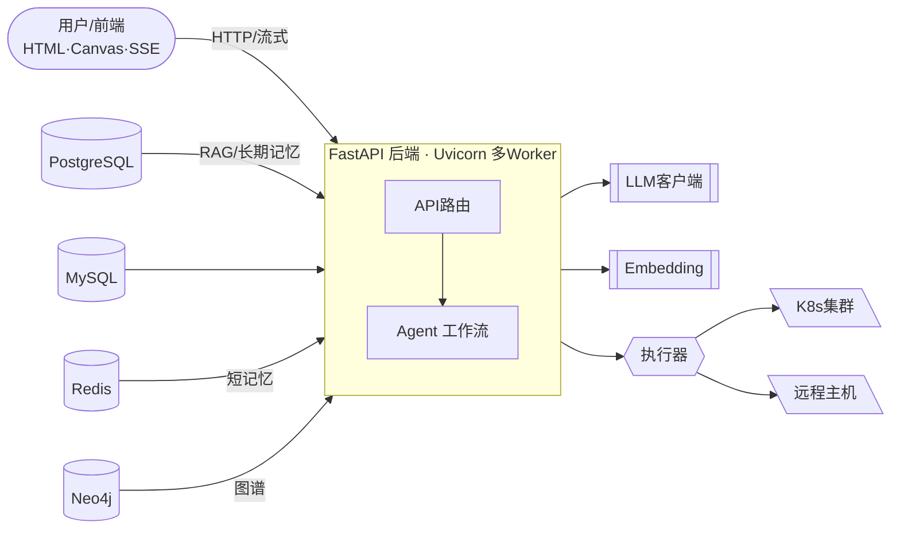
```mermaid
flowchart LR
    U([用户/前端<br/>HTML·Canvas·SSE]) -->|HTTP/流式| API
    subgraph API[FastAPI 后端 · Uvicorn 多Worker]
        RT[API路由] --> WF[Agent 工作流]
    end
    API --> LLM[[LLM客户端]]
    API --> EMB[[Embedding]]
    API --> EXEC{{执行器}}
    EXEC --> K8S[\K8s集群\]
    EXEC --> HOST[\远程主机\]
    PG[(PostgreSQL)] -->|RAG/长期记忆| API
    MY[(MySQL)] --> API
    RD[(Redis)] -->|短记忆| API
    NE[(Neo4j)] -->|图谱| API
```

## H.2 数据源拓扑（2.0）
见第2.0节 flowchart。

## H.3 全库 ER 图（2.3）
见第2.3节 erDiagram。

## H.4 核心业务数据链路（2.4）
见第2.4节 flowchart。

## H.5 策略分类树（3.0）
见第3.0节 flowchart。

## H.6 P6 SSE超时决策树/时序（3.1）
见第3.1节两个图。

## H.7 P0 重试决策树/时序（3.3）
见第3.3节两个图。

## H.8 P2 Embedding 主备决策树/时序（3.6）
见第3.6节两个图。

## H.9 P11 Leader锁决策树（3.8）
见第3.8节 flowchart。

## H.10 场景S1 时序图 (4)
见第4章 S1 sequenceDiagram 与 stateDiagram-v2。

## H.11 场景S2/S3/S5 时序图 (4)
见第4章 S2/S3/S5 sequenceDiagram。

## H.12 故障排查决策树（6.1）
见第6.1节 flowchart。

---

# 附录I 项目文件树

```text
aitem/
├─ main.py                 # 应用装配/lifespan/health
├─ requirements.txt        # 依赖锁定
├─ docker-compose.yml      # PG/Redis/Neo4j/MySQL 编排
├─ .env / .env.example     # 环境配置
├─ pytest.ini
├─ start.ps1 / _probe.py
├─ app/
│  ├─ api/       auth chat conversation document graph knowledge
│  ├─ core/      config logger retry
│  ├─ db/        schema postgres redis neo4j init_db
│  │   ├─ mysql/     database models crud
│  │   └─ repository/ conversation_repository host_repository
│  ├─ document/  parser limits text_utils schemas router multimodal
│  │   └─ extractors/  pdf docx image
│  ├─ knowledge/ ingestion extractor retriever reranker cache ranking
│  │   └─ pipeline/ cleaner loader splitter
│  │   └─ repository/ document incident knowledge_base knowledge_graph
│  ├─ llm/       client vision
│  │   ├─ agents/    workflow base_agent command_rewriter orchestrator
│  │   │            validator observer reporter executor risk_assessor graph_workflow
│  │   └─ embedding/ base jina bge openai dashscope failover factory
│  ├─ memory/     short_term long_term memory_service extractor merge updater classes container
│  │   ├─ graph/   schema indexer
│  │   ├─ job/     decay
│  │   ├─ repository/ memory_repository graph_repository vector_retriever graph_retriever
│  │   └─ strategies/ base preference knowledge experience fault test
│  ├─ prompt/     memory sys mail tools knowledge_prompt
│  ├─ schemas/    check request_format
│  ├─ services/   diagnosis_service document_service docx_export
│  └─ tools/      ssh_client k8s_tools send_mail tool_registry
├─ web/static/    index.html app.js style.css gen_all.py
├─ tests/         test_concurrency test_intent_accuracy test_latency
│                 test_memory_accuracy test_memory_extractor test_memory_merge test_rag_accuracy
├─ scripts/       check_db clear_all_databases dedupe_neo4j hash_passwords migrate_db
├─ docs/          database_schema.md 等设计文档 + 旧版报告
├─ data/          postgres/ redis/ mysql/ neo4j/ uploads/   (运行时数据)
├─ logs/          aitem.log backend.out/err.log error.log
└─ .github/ .vscode/ .continue/
```

---

# 附录J 第三方依赖清单

| 依赖 | 版本 | 用途 | 许可证(推断) |
|---|---|---|---|
| fastapi | 0.115.6 | Web框架 | MIT |
| uvicorn | 0.34.0 | ASGI服务器 | BSD |
| python-multipart | 0.0.20 | 表单上传 | Apache-2.0 |
| openai | 1.59.7 | LLM客户端 | Apache-2.0 |
| httpx | 0.28.1 | HTTP客户端 | BSD |
| asyncpg | 0.30.0 | PG驱动 | Apache-2.0 |
| pgvector | (schema) | 向量扩展 | PostgreSQL |
| sqlalchemy | (未锁) | ORM(MySQL) | MIT |
| pymysql | (未锁) | MySQL驱动 | MIT |
| redis | 5.2.1 | Redis | MIT |
| neo4j | 5.27.0 | Neo4j驱动 | Apache-2.0 |
| cryptography | 44.0.0 | 加密 | Apache-2.0/BSD |
| python-dotenv | 1.0.1 | 环境变量 | BSD |
| pydantic | 2.10.4 | 校验/模型 | MIT |
| pydantic-settings | 2.14.2 | 配置 | MIT |
| sentence-transformers | 3.3.1 | 本地embedding | Apache-2.0 |
| numpy | 2.2.1 | 数值 | BSD |
| paramiko | 3.5.0 | SSH | LGPL-2.1+ |
| PyMuPDF | 1.28.0 | PDF解析 | AGPL/商业 |
| python-docx | 1.1.2 | DOCX解析 | MIT |
| reportlab | 5.0.0 | PDF生成(派生) | BSD(派生自用) |
| openpyxl | 3.1.5 | Excel生成(派生) | MIT(派生自用) |

> 许可证标签为【推断: 需以各包官方声明为准】。完整依赖树未生成（未运行 pip freeze）。

---

# 索引

| 关键词 | 章节 |
|---|---|
| 数据库/表/ER | 2 |
| app_user/host/conversation | 2.2.1–2.2.4 |
| memory/document/incident | 2.2.5–2.2.9 |
| Redis/缓存/短记忆 | 3.4, 2.0 |
| 重试/P0-P1 | 3.3 |
| 兜底策略全集/ID | 3, 附录C |
| Embedding头备/P2 | 3.6 |
| 消息队列 | 3.5 (未实现) |
| 全局异常处理器 | 3.12 (未实现) |
| 业务场景 S1–S6 | 4 |
| 测试 | 5 |
| 运维/应急/巡检 | 6 |
| ADR | 7 |
| 技术债务/路线图 | 8 |
| 合规/安全 | 9 |
| DDL | 附录A |
| 配置清单 | 附录B |
| 枚举/状态码 | 附录D |
| 数据字典 | 附录E |
| API端点 | 附录G |
| 依赖清单 | 附录J |
| 未实现项汇总 | 3.5/3.12/3.14/3.15/5.2-5.4/6.x |

---

## 报告更新记录

| 日期 | 版本 | 变更内容 | 作者 |
|---|---|---|---|
| 2026-08-11 | v3.0 | 基于 master@3e3a165 生成完整版 | Codex |

> 后续修改代码后，请更新 0.3 版本信息、受影响表/策略章节，并在本表追加记录。
